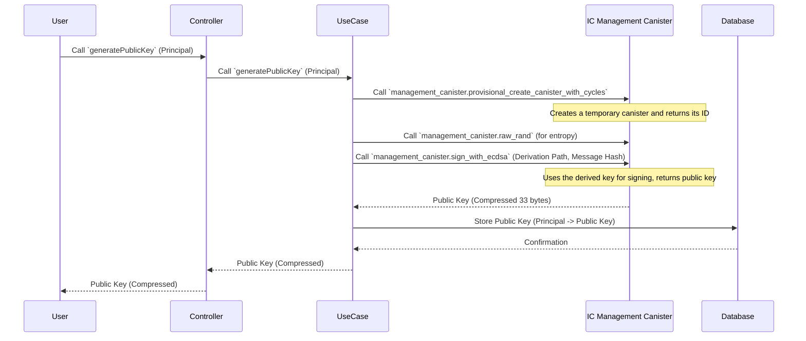
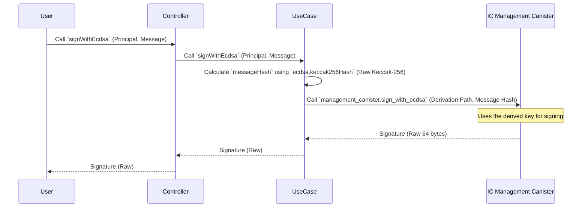
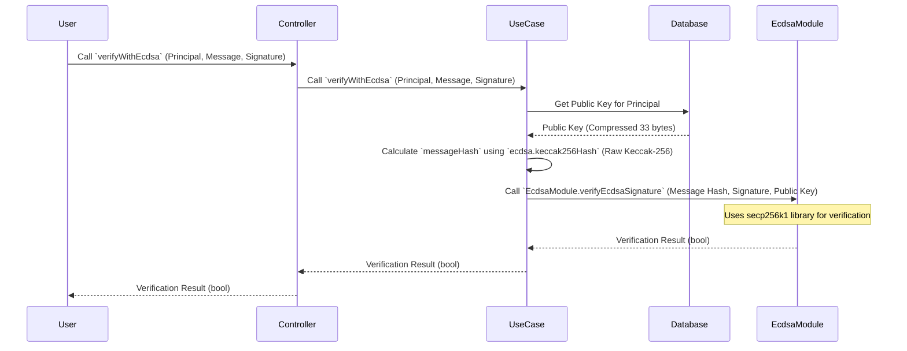

# ECDSA Public Key, Signature, and Verification Overview

This document summarizes ECDSA public key formats, signature formats, and verification flows in ICP and Ethereum, and provides implementation examples for their respective Nim modules (`ecdsa.nim`, `ethereum.nim`).

---

## 1. Public Key Formats

### 1.1 Compressed Form
- Byte length: 33 bytes
- First byte: `0x02` or `0x03` (Y-coordinate parity information)
- Hexadecimal representation: 66 characters

### 1.2 Uncompressed Form
- Byte length: 65 bytes
- First byte: `0x04`
- Hexadecimal representation: 130 characters

Y-coordinate is restored using the following equation:
```text
Y^2 ≡ X^3 + aX + b  (mod p)
// secp256k1: a = 0, b = 7
```

---

## 2. Signature Formats

### 2.1 Raw (Compact) Format
- r (32 bytes) ∥ s (32 bytes) = 64 bytes
- Hexadecimal representation: 128 characters

### 2.2 DER Format (ASN.1)
- SEQUENCE starting with `0x30`
- Variable-length encoding for `INTEGER(r)`, `INTEGER(s)`

### 2.3 Recovery ID (V value)
- Used in Ethereum for public key recovery (0, 1, 2, 3)
- Encoded as `v = 27 + recovery_id` or `v = 35 + recovery_id` (EIP-155)

---

## 3. Verification Flow

### 3.1 Generic ECDSA Verification (ICP)
1. Convert hex to byte array (`hexToBytes`)
2. Public key format determination: Discern compressed/uncompressed by length and first byte, restore Y if necessary.
3. Signature parsing: **ICP management canister returns signatures in Raw (64-byte) format.**
4. Normalize s (Low-S enforcement)
5. Message hash calculation: **Raw Keccak-256** → 32-byte hash (not EIP-191 format)
6. ECDSA verification: `verifyEcdsaSignature(msgHash, signatureBytes, pubKeyBytes)` → bool

### 3.2 Ethereum Signature Verification
1. Format message to EIP-191 format and Keccak-256 hash (`ethereum.keccak256Hash`)
2. Extract r, s, v with `parseSignature`
3. Recover public key using `recoverPublicKeyFromSignature(messageHash, signatureHex, recoveryId)` for each recoveryId (0, 1)
4. Generate address with `publicKeyToEthereumAddress(pubKey)` → Compare with input address

---

## 4. Nim Module API

### 4.1 ecdsa.nim
```nim
proc verifyEcdsaSignature*(
  messageHash: seq[uint8],
  signature: seq[uint8],
  publicKey: seq[uint8]
): bool

proc keccak256Hash*(message: string): seq[uint8]  # Raw Keccak-256
proc hexToBytes*(hexStr: string): seq[uint8]
proc toHexString*(bytes: seq[uint8]): string
```

### 4.2 ethereum.nim
```nim
proc verifyEthereumSignatureWithAddress*(
  ethereumAddress: string,
  message: string,
  signatureHex: string
): bool

proc recoverPublicKeyFromSignature*(
  messageHash: seq[uint8],
  signatureHex: string,
  recoveryId: uint8
): seq[uint8]

proc publicKeyToEthereumAddress*(pubKey: seq[uint8]): string
proc icpPublicKeyToEvmAddress*(icpPublicKey: seq[uint8]): string
proc keccak256Hash*(data: string): seq[uint8] # EIP-191 Keccak-256
proc hexToBytes*(hexStr: string): seq[uint8]
proc parseSignature*(signatureHex: string): tuple[r: seq[uint8], s: seq[uint8], v: uint8]
```

---

## 5. Usage Examples

### 5.1 Generic ECDSA Verification (ICP)
```nim
let messageHash = ecdsa.keccak256Hash(message)  # Raw Keccak-256 hash
let sigBytes = hexToBytes(sigHex)  # Raw signature (64 bytes)
let pubKeyBytes = hexToBytes(pubKeyHex)  # Compressed public key
let ok = verifyEcdsaSignature(messageHash, sigBytes, pubKeyBytes)
echo "Signature valid: ", ok
```

### 5.2 Ethereum Signature Verification
```nim
let address = "0x742d35Cc6634C0532925a3b8D4C9db96C4b4d8b6"
let message = "Hello, World!"
let signature = "0x1234..."
let valid = ethereum.verifyEthereumSignatureWithAddress(address, message, signature)
echo "Ethereum signature valid: ", valid
```

### 5.3 Public Key Recovery from Signature
```nim
let messageHash = ethereum.keccak256Hash(message) # EIP-191 Keccak-256 hash
let signatureHex = "0x..."
let recoveryId: uint8 = 0
let recoveredPubKey = recoverPublicKeyFromSignature(messageHash, signatureHex, recoveryId)
echo "Recovered Public Key (hex): ", toHexString(recoveredPubKey)
```

---

## 6. Ethereum Address Derivation
1. Decompress compressed public key (33 bytes) → uncompressed (65 bytes) (`decompressPublicKey`)
2. Remove leading `0x04` → 64 bytes coordinate data
3. Hash with **Raw Keccak-256** (not EIP-191 format)
4. Lower 20 bytes of hash result → hex string with `0x` prefix

---

## 7. ICP Public Key to Ethereum Address Conversion

```nim
proc icpPublicKeyToEvmAddress*(icpPublicKey: seq[uint8]): string
```

This function converts an ICP-derived public key (compressed 33-byte format) to an Ethereum address. Internally, it performs decompression, hashing, and address formatting.

---

## 8. Implementation Design Document

### 8.1 System Architecture

#### Architecture Overview
```
┌─────────────────┐    ┌─────────────────┐    ┌─────────────────┐
│   Controller    │    │    UseCase      │    │    Database     │
│   (API Layer)   │───▶│  (Business Layer)│───▶│   (Data Layer)  │
└─────────────────┘    └─────────────────┘    └─────────────────┘
         │                       │                       │
         ▼                       ▼                       ▼
┌─────────────────┐    ┌─────────────────┐    ┌─────────────────┐
│  nicp_cdk       │    │  secp256k1      │    │  Table[Principal,│
│  (IC Integration)│    │  (Cryptography) │    │   seq[uint8]]   │
└─────────────────┘    └─────────────────┘    └─────────────────┘
```

#### Module Structure
- **controller.nim**: Candid interface layer (API endpoints)
- **usecase.nim**: Business logic layer (application logic, ICP management canister interaction)
- **database.nim**: Data layer (public key persistence)
- **ecdsa.nim**: Core ECDSA utilities (hashing, verification, format conversion)
- **ethereum.nim**: Ethereum-specific utilities (EIP-191 hashing, address derivation, signature recovery)

### 8.2 Data Flow Design

#### 8.2.1 Public Key Generation Flow


#### 8.2.2 ECDSA Signature Flow


#### 8.2.3 ECDSA Verification Flow


### 8.3 Implementation Specification

#### 8.3.1 Controller Layer (`controller.nim`)
- Defines Candid interfaces for:
    - `get_public_key`: Retrieves a public key associated with a Principal.
    - `sign_with_ecdsa`: Generates an ECDSA signature for a given message using a Principal's derived key.
    - `verify_with_ecdsa`: Verifies an ECDSA signature against a message and a Principal's public key.
    - `verify_ethereum_signature`: Verifies an Ethereum-style ECDSA signature against an address.
    - `get_ethereum_address_from_principal`: Derives an Ethereum address from an ICP Principal's public key.
- Error handling: Maps internal errors to Candid-compatible error types.

#### 8.3.2 UseCase Layer (`usecase.nim`)
- Implements core business logic for ECDSA operations.
- Interacts with `ic_cdk.api.management_canister` for:
    - `sign_with_ecdsa`: Calls the management canister for actual signing.
    - `public_key`: Retrieves the public key from the management canister.
- Interacts with `database.nim` for public key storage and retrieval.
- Utilizes `ecdsa.nim` for generic ECDSA operations (hashing, verification).
- Utilizes `ethereum.nim` for Ethereum-specific operations (EIP-191 hashing, address derivation, recovery).
- Derivation Path Management:
    - Currently, a fixed derivation path is used for each Principal.
    - Future considerations: Allow users to specify custom derivation paths.

#### 8.3.3 Database Layer (`database.nim`)
- Manages persistent storage of public keys.
- Uses a `Table[Principal, seq[uint8]]` (Nim's hash table equivalent) to store public keys, mapping each Principal to its compressed 33-byte public key.
- Ensures public key uniqueness per Principal.
- Persistence: Stored keys are automatically persisted across canister upgrades using Nim's ORC memory management (garbage collection with reference counting) combined with stable memory.

### 8.4 Cryptographic Processing Details

#### 8.4.1 Interaction with IC Management Canister
- `sign_with_ecdsa` and `public_key` functions in `usecase.nim` directly call the corresponding methods on the IC Management Canister.
- These calls are asynchronous and handled by `nicp_cdk`'s `call` mechanism.
- The management canister handles the secure storage and derivation of private keys, ensuring they never leave the IC.

#### 8.4.2 secp256k1 Library Integration Pattern
- The `ecdsa.nim` module integrates with the underlying `secp256k1` C library (via `secp256k1.nim` bindings).
- **Key Functions**:
    - `secp256k1_ec_pubkey_parse`: Parses public keys (compressed or uncompressed).
    - `secp256k1_ecdsa_verify`: Performs ECDSA signature verification.
    - `secp256k1_ecdsa_recover`: Recovers a public key from a message and signature (used in Ethereum verification).
- **Flow for verification using secp256k1**:
    1. `hexToBytes` to convert signature and public key from hex string to byte array.
    2. Raw signature parsing: Process 64-byte r||s format.
    3. Use the secp256k1 library:
        - Create a signature object using `SkSignature.fromHex()` (Nim binding for `secp256k1_ecdsa_signature_parse_compact`).
        - Create a message object using `SkMessage.fromBytes()` (Nim binding for `secp256k1_ecdsa_verify`).
        - Create a public key object using `SkPublicKey.fromRaw()` (Nim binding for `secp256k1_ec_pubkey_parse`).
        - Execute signature verification using `verify()` (Nim binding for `secp256k1_ecdsa_verify`).

#### 8.4.3 Keccak-256 Hash Generation
- Two distinct Keccak-256 hash implementations are used:
    - **`ecdsa.keccak256Hash`**: Generates a raw Keccak-256 hash of the input message. Used for generic ECDSA signatures (e.g., ICP management canister `sign_with_ecdsa`).
    - **`ethereum.keccak256Hash`**: Implements the EIP-191 standard, which prefixes the message with `"\x19Ethereum Signed Message:\n" + length_of_message`. Used for Ethereum-compatible signature verification.

### 8.5 Security and Error Handling

#### 8.5.1 Principal-based Authentication System
- All operations (`generatePublicKey`, `signWithEcdsa`, `verifyWithEcdsa`) are tied to a `Principal` (user or canister ID).
- This ensures that keys are derived and operations are performed on behalf of authenticated identities within the IC ecosystem.

#### 8.5.2 Double-Check Mechanism for Signature Verification
- In `verifyWithEcdsa`, the public key is first retrieved from the local database (if cached).
- The signature is then verified against this public key and the message hash.
- This provides an initial quick check. For critical applications, an additional check might involve re-deriving the public key from the management canister (if not already cached and trusted) and verifying again, or using Ethereum's recovery mechanism for cross-validation.

#### 8.5.3 Type-Safe Error Handling with Result Type
- Nim's `Result` type (or similar pattern) is used for functions that might fail.
- This ensures that potential errors (e.g., invalid input, management canister call failures) are explicitly handled, preventing unexpected panics.
- Example: `signWithEcdsa` returns a `Result[seq[uint8], CustomError]`.

### 8.6 Performance Optimization

#### 8.6.1 Public Key Caching Mechanism
- Public keys derived from the IC Management Canister are cached in the `database.nim` module (`Table[Principal, seq[uint8]]`).
- This minimizes redundant calls to the management canister, reducing latency and cycle costs for subsequent operations involving the same Principal's public key.

#### 8.6.2 Concurrency through Asynchronous Processing
- The `nicp_cdk` leverages Nim's asynchronous capabilities for inter-canister calls (e.g., to the management canister).
- This allows the canister to handle multiple concurrent requests efficiently without blocking the main execution thread while waiting for external replies.

#### 8.6.3 Memory-Efficient Byte Array Processing
- Signature, public key, and message hash operations primarily use `seq[uint8]` (Nim's equivalent of `Vec<u8>` or `bytes`).
- This ensures efficient memory usage and avoids unnecessary conversions, which is crucial in the constrained memory environment of IC canisters.

### 8.7 Implemented Features

The following features have been fully implemented and tested:

1.  **Public Key Generation and Storage**:
    - Generates a `secp256k1` public key for a given Principal using the IC Management Canister.
    - Stores the derived public key persistently.
    - Example: `dfx canister call t_ecdsa_backend generate_public_key \'(principal "aaaaa-aa")\'`

2.  **ECDSA Signature Creation**:
    - Signs a given message using the derived public key from the IC Management Canister.
    - Returns the signature in Raw (compact) format.
    - Example: `dfx canister call t_ecdsa_backend sign_with_ecdsa \'(principal "aaaaa-aa", "Hello, World!")\'`

3.  **Generic ECDSA Signature Verification**:
    - Verifies an ECDSA signature using the public key associated with a Principal.
    - Example: `dfx canister call t_ecdsa_backend verify_with_ecdsa \'(principal "aaaaa-aa", "Hello, World!", "0x...")\'`

4.  **Ethereum-style Signature Verification**:
    - Verifies an ECDSA signature compatible with Ethereum\'s EIP-191 standard.
    - Recovers the public key and derives the Ethereum address for verification.
    - Example: `dfx canister call t_ecdsa_backend verify_ethereum_signature \'("0x742d35Cc6634C0532925a3b8D4C9db96C4b4d8b6", "Hello, World!", "0x...")\'`

5.  **Ethereum Address Derivation from ICP Public Key**:
    - Converts an ICP-derived public key (compressed `secp256k1` format) into an Ethereum address.
    - Example: `dfx canister call t_ecdsa_backend get_ethereum_address_from_principal \'(principal "aaaaa-aa")\'` 