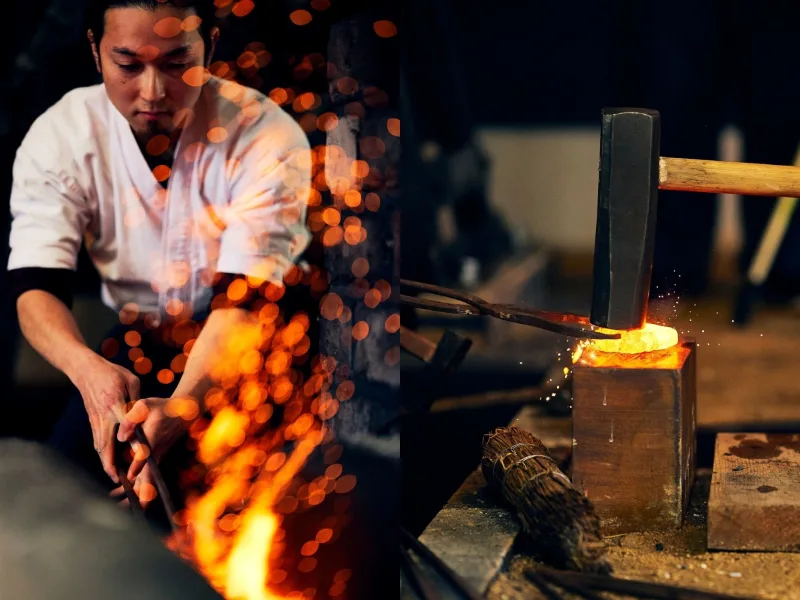
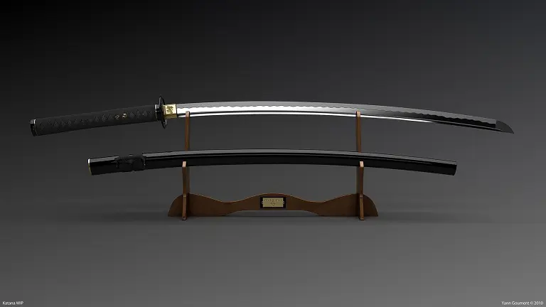
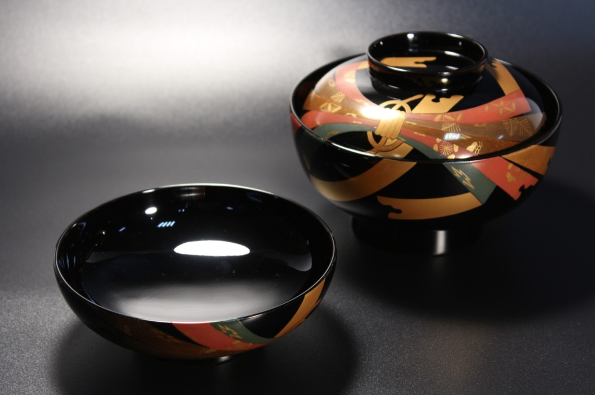
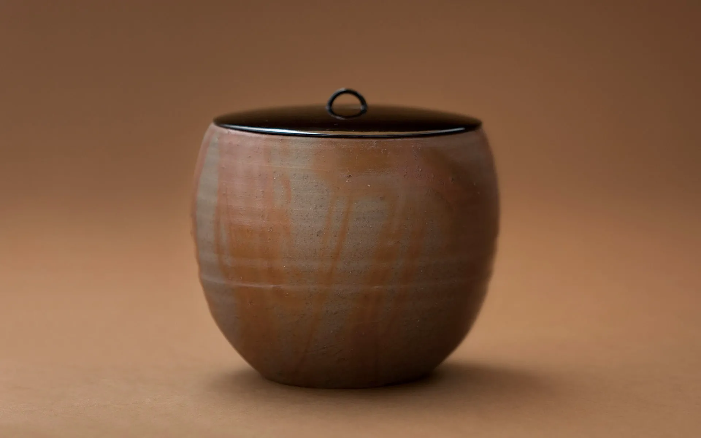
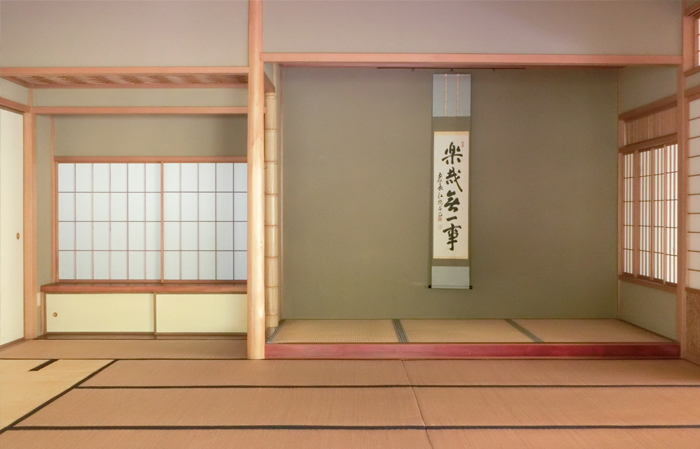
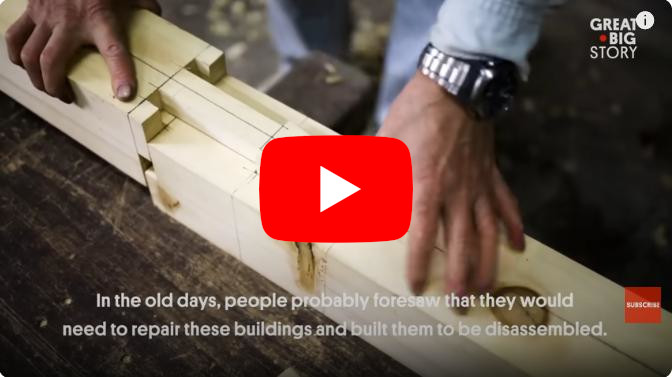

# The Strength in Simplicity: The Aesthetics of Japanese Traditional Crafts and Distributed Systems

In the winter dawn, at a blacksmith's forge where sparks fly, a samurai swordsmith hammers a piece of steel heated to a crimson glow. The folded and forged steel transforms into a blade with a clean, beautiful curve, said to possess a legendary sharpness, resilience, and elegant appearance thanks to the exquisite balance of hardness and toughness. Meanwhile, in a distant modern data center, a distributed blockchain network operates silently. On this network, the Internet Computer (ICP), where countless computers collaborate, code (smart contracts) runs on a versatile virtual execution environment called WebAssembly (WASM), quietly shaping the future of the internet. At first glance, the samurai's workshop and the cutting-edge digital world seem far apart, but they share a common philosophy: the strength and beauty born from "simplicity." It's the aesthetic of simplicity nurtured by Japanese traditional culture and the exceptional durability and functionality it creates. And in modern distributed system design, a surprisingly similar aesthetic underpins efficient and reliable technological foundations. We will explore the philosophy of "simplicity" seen in Japanese traditional craftsmanship and the design principles of the latest distributed technologies, exemplified by Dfinity's ICP, and consider the resonance between their aesthetics and functions.

## The Simple Beauty and Robustness Inherent in Ancient Crafts

### Japanese Sword: The Structural Beauty of Folded Steel

The Japanese sword (Nihonto) is known worldwide for its refined shape and functional beauty. The blade is made through a process called "folding and forging," where steel is folded and hammered multiple times. This process makes the edge extremely hard and sharp, while the core retains appropriate flexibility. The result is a combination of **hardness** and **toughness**. This ingenious structure gives the Japanese sword exceptional strength, making it resistant to breaking and bending. The hamon (temper line) created by traditional quenching, while arising from functional necessity, imparts a unique and beautiful expression to the sword. For example, the wavy hamon that appears on the blade indicates the boundary between the hard edge and the resilient spine, symbolizing both the sword's aesthetics and sharpness. It is not uncommon to find famous swords forged hundreds of years ago that remain unbroken to this day. The shape of the Japanese sword itself is simple and functional, but the complex craftsmanship and structural design within it achieve unparalleled robustness and longevity.

### Lacquerware: Simple Elegance in Layers

Lacquerware (Urushi-kogei) is an indispensable traditional technique when discussing the Japanese "beauty of simplicity." Lacquered objects, completed through the seemingly endless repetitive process of applying layers of natural lacquer to vessels made of wood or Japanese paper, drying them, and polishing them, have a calm appearance with a quiet luster at first glance. Patterns and decorations are often modest or absent, and their **simple forms** possess a dignified elegance. However, beneath the beautiful surface, a robust film formed by multiple layers of lacquer provides the vessel with high resistance to scratches, stains, and heat. Lacquer hardens and strengthens over time, so properly cared for lacquerware has durability that allows it to be used for generations. Its luster deepens with use, maintaining its beauty while continuing to function as a practical item for a long time. The lacquerware, which competes with the beauty of its materials and techniques without relying on extravagant decorations, embodies the essence of Japanese beauty: "achieving much with little."

### Bizen Ware: The Strength of Wabi Born from Earth and Fire

In the world of ceramics, there is also a masterpiece that demonstrates the fusion of Japanese simple beauty and durability: Bizen ware from Okayama Prefecture. Bizen ware is created by shaping high-quality clay and then firing it slowly for a long time without using any glaze. It is characterized by its simple reddish-brown or dark brown color, and the surface features natural patterns created by fire and ash. Its appearance is樸訥 (bokutotsu - simple and unadorned), with a quiet texture that resonates with the aesthetic of "wabi-sabi." This simple pottery, created only from earth and fire, is surprisingly sturdy despite its unassuming appearance. Because the clay is fired at high temperatures of over 1200 degrees Celsius, it becomes dense and hard, known for its resistance to chipping. In fact, Bizen ware vessels, even if thin, are reputedly surprisingly durable and can withstand many years of use. Due to its robustness, it has been prized as a tea utensil in the world of tea ceremony. Bizen ware, which is unadorned and natural yet possesses the strength for practical use, embodies the fusion of the simple aesthetics and practicality sought by Japanese culture.

### Sukiya Architecture: The Light Structure of a Wabi-Style Teahouse

In Japanese traditional architecture, there are also many examples where "simplicity" has enhanced formative beauty and functionality. Among these, the **Sukiya-zukuri** architectural style, born from the spirit of the tea ceremony, pursues a refined spatial beauty while being simple and unpretentious. In Sukiya architecture, which centers around a teahouse, natural materials are utilized to create a calm space where wood, bamboo, and earthen walls harmonize. Pillars and beams are slender, and the interior space has only the necessary minimum size, intentionally designed to be simple. However, this "lightness" does not mean fragility. In Sukiya architecture, advanced structural calculations and craftsmanship are employed in unseen parts to ensure a stable building with minimal materials. Wood pieces are precisely joined using traditional joinery (shikuchi), and even when nails or metal fittings are used where necessary, they are skillfully hidden from view. The wisdom of traditional wooden construction, **wood joinery (kigumi)**, allows forces to be transmitted in a balanced manner, enabling slender pillars to flexibly support loads and respond to tremors such as earthquakes. Masterpieces of Sukiya architecture, such as the Katsura Imperial Villa, possess structural stability despite their simple design and have maintained their beautiful appearance for centuries. Sukiya architecture, which conceals robustness within its wabi-style tranquility, can be said to be an architectural art born from the aesthetic sense and technical skills of the Japanese people.

### Miyadaiku Wood Joinery: The Strength of Nail-Free Construction

The skills of **Miyadaiku**, carpenters who specialize in building shrines and temples, are indispensable when discussing Japanese wooden architecture. For centuries, they have refined the technique of wood joinery (mortise and tenon), intricately combining pieces of wood to assemble massive structures without using nails. A structure that doesn't rely on nails dramatically extends the lifespan of the wood and flexibly responds to tremors such as earthquakes. In fact, the fact that Horyuji Temple's five-story pagoda (built in the 7th century), one of the world's oldest wooden structures, has stood for over 1300 years in earthquake-prone Japan is said to be due to the ingenuity of its wood-joined structure. The joints of the wood are carved into mating male and female shapes that interlock firmly with **mortise and tenon joints (shikuchi)**, making them strong. Moreover, because they don't use hard metal nails, the natural breathing and movement of the wood are not hindered. When nails are absolutely necessary, they use **Wa-kugi**, Japanese nails made of iron that are lighter and softer than Western nails, taking care not to split the wood. Wa-kugi are characterized by their soft material, which allows them to bend slightly along the grain of the wood and follow its movement. Thanks to these traditional techniques, it has become possible to join pillars and beams durably and strongly without using nails, creating buildings that also showcase the beautiful design of wood joinery. The shrine and temple architecture and stage constructions (e.g., the Kiyomizu-dera Temple stage in Kyoto) built by Miyadaiku amaze visitors as miracles of massive wooden structures erected without a single nail. The organic joints created by complex joinery are functional beauty itself, a testament to how Japanese traditional architecture pursued strength and sustainability for not just a "hundred-year plan" but for a thousand years and beyond.

## Simplicity in Modern Technology: ICP Protocol and Nim Language

### Internet Computer (ICP): The Next-Generation Infrastructure Supported by WASM

https://internetcomputer.org/

Developed by the Dfinity Foundation, the **Internet Computer Protocol (ICP)** is an ambitious project aiming to build a decentralized computing resource on the internet based on blockchain technology. ICP distinguishes itself from traditional blockchains by striving to be a platform capable of executing smart contracts (referred to as **canisters** in ICP) with web-like speed and scalability. A core technical element underpinning this is the utilization of **WebAssembly (WASM)**. In ICP, smart contracts written by developers are compiled into WASM binary format and executed on virtual machines on each node. Originally developed for web browsers as a low-level virtual machine specification, WASM excels in security, efficiency, and determinism, making it ideally suited for running arbitrary code across nodes on a blockchain. Thanks to this deterministic and high-speed execution environment, smart contracts on ICP are processed uniformly across all nodes without discrepancies in results, ensuring high reliability. Furthermore, an advantage of using WASM is the flexibility it offers, allowing contract development in a wide range of programming languages. While ICP officially supports several languages such as Motoko, Rust, and TypeScript, as long as a compiler is available, canisters can be developed using other languages that target WASM.

Moreover, ICP employs cryptographic techniques in every aspect of its operation. Each subnet manages private keys in a distributed manner using a threshold secret sharing scheme, and the nodes collectively generate a threshold signature for the response results of canisters. ICP adopts a BLS-based threshold signature scheme, which minimizes the signature overhead and communication rounds upon message reception by pre-calculating pre-signatures. Actual responses are accompanied by a single BLS signature composed of partial signatures from each node, and clients can verify this signature using only the subnet's public key within tens of milliseconds. This mechanism allows users to ensure the authenticity of responses at low cost and mathematically deterministically without synchronizing the entire chain. Additionally, since private keys are always kept in a fragmented state, the risk of key leakage due to the compromise of a single node is significantly reduced, dramatically enhancing security.

By providing such a robust and flexible foundation, ICP aims to rebuild internet services themselves on the blockchain, realizing a long-lived and tamper-proof digital infrastructure. At the heart of its design philosophy seems to lie the principle of "strength gained by pursuing simplicity."

### Nim Programming Language: The Pursuit of Efficiency, Expressiveness, and Elegance

https://nim-lang.org/

When discussing the ICP technology stack, it's also necessary to touch upon the programming languages used to write smart contracts. While Motoko and Rust are often used officially as mentioned earlier, this section will focus on the **Nim** language from the perspective of contrasting it with Japanese aesthetics. Nim is a relatively new programming language that has been gaining attention in recent years, and its design philosophy is encapsulated in the words "Efficient, Expressive, Elegant." Nim is a statically-typed compiled language that aims to combine the readability of Python with the execution efficiency comparable to C, featuring a concise syntax that is easy for humans to read and write. In fact, the Nim compiler translates source code into highly optimized C code (or other languages) and generates native code, allowing it to produce small and lightweight executables without relying on virtual machines or garbage collection. Memory management also uses automatic reference counting (ARC) by default, which ensures predictable behavior suitable for system programming by releasing memory at deterministic times. For this reason, programs written in Nim tend to perform well even under resource constraints, such as in embedded systems or blockchain contracts. Furthermore, Nim is expressive due to its macro system and support for multiple programming paradigms (procedural, object-oriented, functional), providing developers with the flexibility to describe intended behavior concisely. In other words, it's a language that offers a "simple" coding experience where one can focus on the essential logic without being bothered by redundant boilerplate code or complex syntax. Code written in Nim achieves its purpose with the minimum necessary description, and efficiency is pursued without excess during execution. This philosophy seems to resonate with the Japanese craftsmanship approach of "eliminating waste and refining the essence."

## Resonance of Traditional Beauty and Modern Technology: On the Philosophy of Simplicity

The "pursuit of simplicity" that has long been ingrained in Japanese craftsmanship is not merely an aesthetic preference but has also brought significant practical advantages in terms of durability and functionality. The same holds true in modern systems engineering. Rather than endlessly accumulating complexity, refining the core design philosophy leads to **efficient, maintainable, and robust systems**. In Japanese traditional crafts, it has been considered virtuous to enhance the perfection of a work using only the inherent qualities of the materials and ingenious structures, without relying on unnecessary decorations or parts. This aligns with the idea in the world of information technology that keeping designs simple and reducing the number of software components (dependencies and modules) as much as possible increases the reliability of the system. Indeed, in software architecture, systems with simple and clear structures are said to withstand the test of time because error locations are easier to identify and modifications are easier to make.

Especially in a decentralized system infrastructure like ICP, code deployed to the network is expected to run unchanged for a long period. In that sense, software on the blockchain, which is difficult to modify later, requires a design and implementation that is as simple and bug-free as possible. ICP's architecture, which chose WASM as its execution foundation, enhances predictability of behavior and security by adopting a low-level and highly deterministic system, thereby eliminating unnecessary "magic." This is similar to how master carpenters support buildings with only the pure combination of wood and control the behavior of the structure with their craftsmens' wisdom. In traditional Japanese joinery, external elements such as nails and bolts are minimized, and strength is derived solely from the combination of materials. Similarly, ICP aims to reduce the overall complexity of the system by running only the necessary minimum mechanisms on an open and minimal virtual machine called WASM, and by making it easily verifiable through cryptographic techniques. The low-level control capabilities of WASM and its elegant design philosophy bring about lean stability, much like highly refined woodwork.

Furthermore, modern development tools, exemplified by the Nim language, offer insights that can be learned from Japanese tradition. Nim code is concise and easy to read, yet it operates efficiently after compilation. This is a philosophy that resonates with the Japanese sword and lacquerware: "simple in appearance, robust within." For example, just as the hamon supports the rugged and substantial blade, Nim's lightweight runtime and optimized compilation support the robustness of the program in unseen parts. The elegant syntax that does not impose unnecessary burdens on developers is like Japanese traditional tools that enhance the craftsman's skill without making the tool itself conspicuous. As a result, the software (product) created is streamlined, easy to maintain, and reliable for long-term use.

Extremely refined simplicity enables the coexistence of beauty and function. Just as Japanese shrine and temple architecture has endured centuries of wind and snow, continuing to fascinate people, excellent software systems also have the potential to provide value over time. ICP's vision of **"long-lived systems on the internet"** coincidentally resonates with the aspiration for **"perpetual structures"** seen in Horyuji Temple and Ise Grand Shrine. At Ise Grand Shrine, the Shikinen Sengu, a ritual of rebuilding the main sanctuary with the exact same design every 20 years, has continued uninterrupted for 1300 years, which can be said to be a system that is maintainable due to its unchanging design philosophy and simplicity. In system development as well, simple design facilitates continuous improvement and reimplementation in the future, ultimately leading to an extended lifespan. It is an interesting coincidence that tradition and innovation, two seemingly opposing worlds, are connected by the philosophy of simplicity through the common desire to "create things that are useful for a long time."

## Conclusion

The minimalist aesthetics seen in Japanese traditional crafts and the exceptional durability and functionality they produce, and the pursuit of simple design in modern distributed systems and programming languages—these two differ in time and field, but the underlying principles are surprisingly similar. The strength gained by eliminating complexity and focusing on the essence resides in the samurai sword, the lacquered vessel, the wood-joined pagoda, and is passed down through the digital world of blockchain. Being simple does not mean being mediocre. Rather, refined simplicity is the crystallization of advanced wisdom and skill, possessing a universality that withstands the test of time. The teaching left by Japanese artisans that "true beauty and strength lie within simplicity" can be a valuable guideline in 21st-century technology development. Just as architecture and crafts that harmonize with nature endure, the foundation of the digital society we create can also be robust and sustainable because it is simple—the story of tradition and innovation traced in this paper offers us a hint towards such a future.
