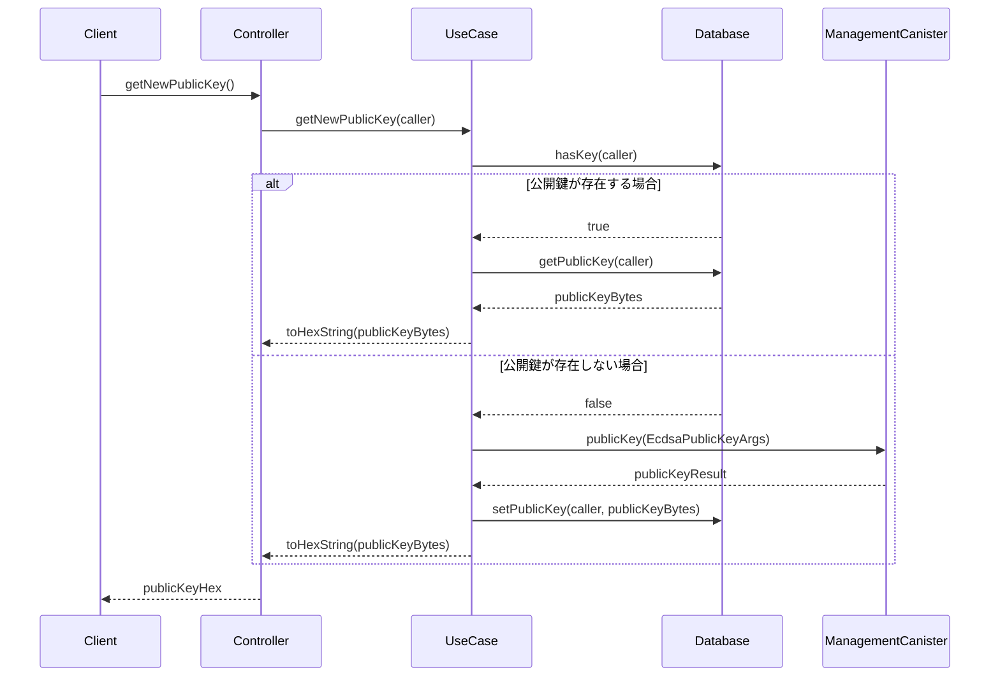
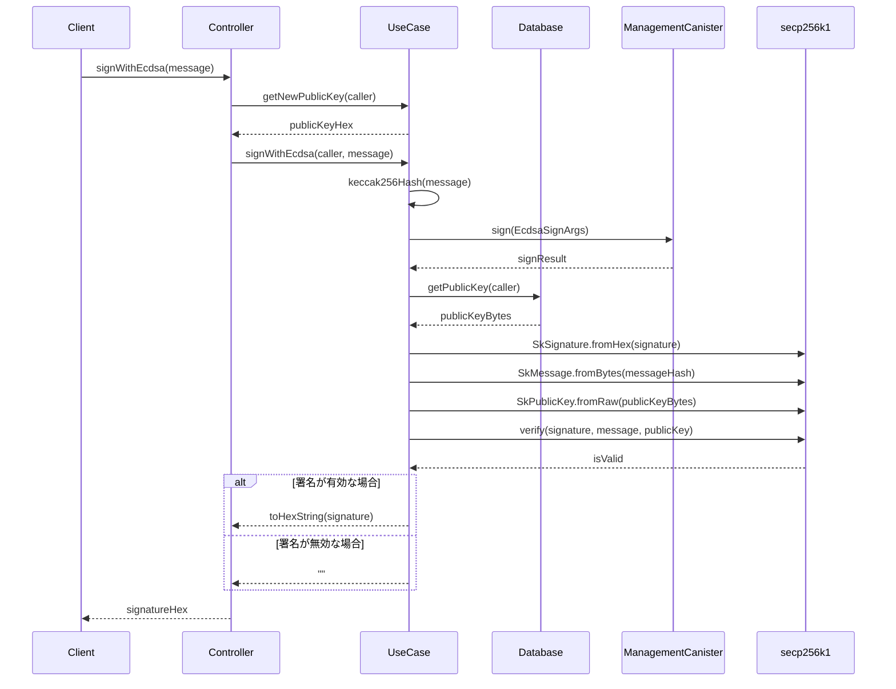
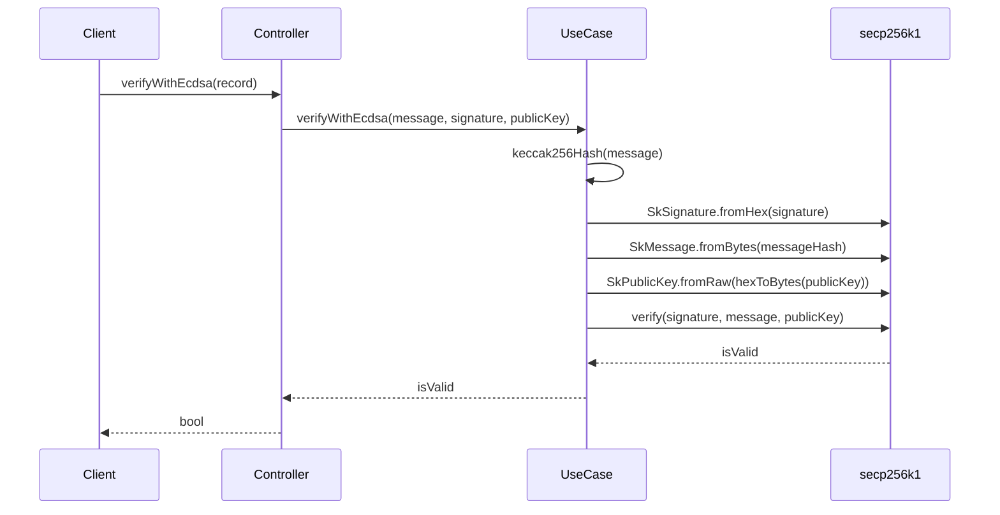

# ECDSA 公開鍵・署名・検証総覧

このドキュメントでは、ICP および Ethereum における ECDSA 公開鍵形式、署名形式、および検証フローをまとめ、それぞれの Nim モジュール（`ecdsa.nim`、`ethereum.nim`）の実装例を示します。

---

## 1. 公開鍵形式

### 1.1 圧縮形式 (Compressed Form)
- バイト長: 33 バイト
- 先頭バイト: `0x02` または `0x03` (Y 座標の偶奇情報)
- hex 表記: 66 文字

### 1.2 非圧縮形式 (Uncompressed Form)
- バイト長: 65 バイト
- 先頭バイト: `0x04`
- hex 表記: 130 文字

Y 座標は以下の式で復元:
```text
Y^2 ≡ X^3 + aX + b  (mod p)
// secp256k1: a = 0, b = 7
```

---

## 2. 署名形式

### 2.1 Raw (Compact) 形式
- r (32 バイト) ∥ s (32 バイト) の 64 バイト
- hex 表記: 128 文字

### 2.2 DER 形式 (ASN.1)
- `0x30` で始まる SEQUENCE
- 可変長エンコーディングによる `INTEGER(r)`, `INTEGER(s)`

### 2.3 Ethereum 形式
- r (32 バイト) ∥ s (32 バイト) ∥ v (1 バイト) の 65 バイト
- hex 表記: 130 文字（0xなし）、0xプレフィックス付きで 132 文字

### 2.4 ICP Management Canister 形式
- **確認済み**: Raw (Compact) 形式 - r (32 バイト) ∥ s (32 バイト) の 64 バイト
- hex 表記: 128 文字
- DER形式ではなく、Raw形式で署名を返す

#### 実証実験結果（2025-07-12）
ICPマネジメントキャニスターの`sign_with_ecdsa`メソッドの返り値形式を実際に検証：

**テスト実行**:
```bash
dfx canister call t_ecdsa_backend signWithEcdsa "hello world"
dfx canister call t_ecdsa_backend signWithEcdsa "test message"
```

**結果**:
- **署名長**: 64バイト（128文字hex）確認
- **形式**: Raw形式（r||s, 32+32バイト）確認
- **DER形式ではない**: 先頭バイトが0x30ではなく、固定64バイト長

**署名例**:
1. メッセージ「hello world」:
   - 署名: `2E845598247622D38C6FAF1CCAD0A91CA3554AA0F81AF50BA9CFC09A5F12999A6CA4D32FC9DFF51CA88F4B5E4742BA6E565973B904E7B6516A9523CA4561019A`
   - 長さ: 64バイト
   - 先頭バイト: 0x2E

2. メッセージ「test message」:
   - 署名: `969397D018F951F999EB791229ED7B7EF6958C5D20E64DD83CE6308433C341E317D52C7F7C76B224F8D78560E08DB3E87D67D08888C2DFAEE741B326413083D6`
   - 長さ: 64バイト
   - 先頭バイト: 0x96

**結論**: ICPマネジメントキャニスターは確実にRaw形式（非DER形式）でECDSA署名を返す。

---

## 3. 検証フロー

### 3.1 汎用 ECDSA 検証 (ICP)
1. hex → バイト列に変換 (`hexToBytes`)
2. 公開鍵形式判定: 長さと先頭バイトで 圧縮/非圧縮 を判別、必要なら Y を復元
3. 署名解析: **ICPマネジメントキャニスターはRaw形式（64バイト）で署名を返す**
4. s の正規化 (Low-S enforcement)
5. メッセージハッシュ計算: **生の Keccak-256** → 32 バイトハッシュ（EIP-191形式ではない）
6. ECDSA 検証: `verifyEcdsaSignature(msgHash, signatureBytes, pubKeyBytes)` → bool

### 3.2 Ethereum 署名検証
1. メッセージを **EIP-191 形式**で整形し Keccak-256 ハッシュ (`ethereum.keccak256Hash`)
2. `parseSignature` で r,s,v を抽出
3. `recoverPublicKeyFromSignature(messageHash, signatureHex, recoveryId)` で公開鍵復元 (recoveryId=0,1)
4. `publicKeyToEthereumAddress(pubKey)` でアドレス生成 → 入力アドレスと比較

### 3.3 ハッシュ関数の違い
- **`ecdsa.keccak256Hash`**: 生のKeccak-256（メッセージをそのままハッシュ）
- **`ethereum.keccak256Hash`**: EIP-191形式（`"\x19Ethereum Signed Message:\n" + length + message`）

---

## 4. モジュール別実装

### 4.1 ecdsa.nim
```nim
proc verifyEcdsaSignature*(
  messageHash: seq[uint8],
  signature: seq[uint8],
  publicKey: seq[uint8]
): bool

proc keccak256Hash*(message: string): seq[uint8]  # 生のKeccak-256
proc hexToBytes*(hexStr: string): seq[uint8]
proc toHexString*(bytes: seq[uint8]): string
```

#### フォーマット
- 公開鍵: `seq[uint8]` 圧縮形式 33 バイト (66 文字 hex)
- 署名: `seq[uint8]` **Raw (Compact) 形式** - ICPマネジメントキャニスターから返される r||s (64バイト)

#### 検証フロー
1. `hexToBytes` でバイト列に変換
2. Raw形式署名の解析: 64バイトの r||s 形式として処理
3. secp256k1ライブラリを使用:
   - `SkSignature.fromHex()` で署名オブジェクト作成
   - `SkMessage.fromBytes()` でメッセージオブジェクト作成
   - `SkPublicKey.fromRaw()` で公開鍵オブジェクト作成
   - `verify()` で署名検証実行

### 4.2 ethereum.nim
```nim
proc verifyEthereumSignatureWithAddress*(
  ethereumAddress: string,
  message: string,
  signatureHex: string
): bool

proc recoverPublicKeyFromSignature*(
  messageHash: seq[uint8],
  signatureHex: string,
  recoveryId: uint8
): seq[uint8]

proc publicKeyToEthereumAddress*(pubKey: seq[uint8]): string
proc icpPublicKeyToEvmAddress*(icpPublicKey: seq[uint8]): string

proc keccak256Hash*(data: string): seq[uint8]     # EIP-191形式
proc keccak256HashRaw*(data: string): seq[uint8]  # 生のKeccak-256
proc parseSignature*(signatureHex: string): tuple[r: seq[uint8], s: seq[uint8], v: uint8]
```

#### フォーマット
- アドレス: `string` (`0x`+40文字 hex)
- 署名: `string` Raw 形式 r(32バイト)+s(32バイト)+v(1バイト) の 65バイト (130文字 hex, 0x付き132文字)

#### 検証フロー
1. `ethereum.keccak256Hash` で EIP-191 形式のハッシュ生成
2. `parseSignature` で r,s,v を抽出
3. 各 recoveryId(0,1) で `recoverPublicKeyFromSignature` → pubKeyBytes
4. `publicKeyToEthereumAddress` で生成されたアドレスと照合

---

## 5. 使用例

### 5.1 汎用 ECDSA 検証 (ICP)
```nim
let messageHash = ecdsa.keccak256Hash(message)  # 生のKeccak-256ハッシュ
let sigBytes = hexToBytes(sigHex)  # Raw形式の署名（64バイト）
let pubKeyBytes = hexToBytes(pubKeyHex)  # 圧縮形式の公開鍵
let ok = verifyEcdsaSignature(messageHash, sigBytes, pubKeyBytes)
echo "Signature valid: ", ok
```

### 5.2 Ethereum 署名検証
```nim
let address = "0x742d35Cc6634C0532925a3b8D4C9db96C4b4d8b6"
let message = "Hello, World!"
let signature = "0x1234..."
let valid = ethereum.verifyEthereumSignatureWithAddress(address, message, signature)
echo "Ethereum signature valid: ", valid
```

---

## 6. Ethereum アドレス導出
1. 圧縮形式公開鍵(33バイト) → 非圧縮形式(65バイト) に展開 (`decompressPublicKey`)
2. 先頭バイト `0x04` を除去 → 64バイト座標データ
3. **生のKeccak-256**でハッシュ化（EIP-191形式ではない）
4. ハッシュ結果の下位 20バイト → `0x` プレフィックス付き hex 文字列

---

## 7. 参考資料
- [libsecp256k1 ドキュメント](https://github.com/bitcoin-core/secp256k1)
- [EIP-191: Signed Data Standard](https://eips.ethereum.org/EIPS/eip-191)
- [EIP-712: Typed Structured Data](https://eips.ethereum.org/EIPS/eip-712) 

---

## 8. 実装設計書

### 8.1 システム全体構成

#### アーキテクチャ概要
```
┌─────────────────┐    ┌─────────────────┐    ┌─────────────────┐
│   Controller    │    │    UseCase      │    │    Database     │
│   (API層)       │───▶│  (ビジネス層)    │───▶│   (データ層)     │
└─────────────────┘    └─────────────────┘    └─────────────────┘
         │                       │                       │
         ▼                       ▼                       ▼
┌─────────────────┐    ┌─────────────────┐    ┌─────────────────┐
│  nicp_cdk       │    │  secp256k1      │    │  Table[Principal,│
│  (IC統合)       │    │  (暗号化)       │    │   seq[uint8]]   │
└─────────────────┘    └─────────────────┘    └─────────────────┘
```

#### モジュール構成
- **controller.nim**: Candidインターフェース層（API エンドポイント）
- **usecase.nim**: ビジネスロジック層（ECDSA操作の実装）
- **database.nim**: データ永続化層（公開鍵の保存）
- **ecdsa.nim**: ECDSA暗号化アルゴリズム実装
- **ethereum.nim**: Ethereum互換性機能

### 8.2 データフロー設計

#### 8.2.1 公開鍵生成フロー (`getNewPublicKey`)


#### 8.2.2 ECDSA署名フロー (`signWithEcdsa`)


#### 8.2.3 ECDSA検証フロー (`verifyWithEcdsa`)


### 8.3 実装仕様

#### 8.3.1 Controller層実装
```nim
# API エンドポイント実装
proc signWithEcdsa*() {.async.} =
  let request = Request.new()
  let message = request.getStr(0)
  let caller = Msg.caller()

  # 公開鍵の事前生成を保証
  discard await usecase.getNewPublicKey(caller)
  
  try:
    let signature = await usecase.signWithEcdsa(caller, message)
    reply(signature)
  except Exception as e:
    echo "Error in signWithEcdsa: ", e.msg
    reject("Failed to sign with ECDSA: " & e.msg)

proc verifyWithEcdsa*() =
  let request = Request.new()
  let argRecord = request.getRecord(0)
  let message = argRecord["message"].getStr()
  let signature = argRecord["signature"].getStr()
  let publicKey = argRecord["publicKey"].getStr()

  try:
    let isValid = usecase.verifyWithEcdsa(message, signature, publicKey)
    reply(isValid)
  except Exception as e:
    echo "Error in verifyWithEcdsa: ", e.msg
    reject("Failed to verify with ECDSA: " & e.msg)
```

#### 8.3.2 UseCase層実装
```nim
# ビジネスロジック実装
proc signWithEcdsa*(caller: Principal, message: string): Future[string] {.async.} =
  # 1. メッセージハッシュ生成
  let messageHash = ecdsa.keccak256Hash(message)

  # 2. ICマネジメントキャニスターへの署名要求
  let arg = EcdsaSignArgs(
    message_hash: messageHash,
    derivation_path: @[caller.bytes],
    key_id: EcdsaKeyId(
      curve: EcdsaCurve.secp256k1,
      name: "dfx_test_key"
    )
  )

  let signResult = await ManagementCanister.sign(arg)
  
  # 3. secp256k1ライブラリによる署名検証
  let sigResult = SkSignature.fromHex(signResult.signature.toHexString())
  let msgResult = SkMessage.fromBytes(messageHash)
  let pubKeyResult = SkPublicKey.fromRaw(hexToBytes(getPublicKey(caller)))
  
  # 4. エラーハンドリング
  if sigResult.isErr or msgResult.isErr or pubKeyResult.isErr:
    echo "Error parsing signature components:"
    if sigResult.isErr:
      echo "  Signature error: ", sigResult.error
    if msgResult.isErr:
      echo "  Message error: ", msgResult.error
    if pubKeyResult.isErr:
      echo "  Public key error: ", pubKeyResult.error
    return ""
  
  # 5. 署名検証実行
  let isValid = secp256k1.verify(
    sigResult.get(),
    msgResult.get(),
    pubKeyResult.get()
  )
  echo "isValid: ", isValid

  # 6. 結果返却
  if isValid:
    return toHexString(signResult.signature)
  else:
    return ""

proc verifyWithEcdsa*(message: string, signature: string, publicKey: string): bool =
  # 1. メッセージハッシュ生成
  let messageHash = ecdsa.keccak256Hash(message)

  # 2. secp256k1オブジェクト生成
  let sigResult = SkSignature.fromHex(signature)
  let msgResult = SkMessage.fromBytes(messageHash)
  let pubKeyResult = SkPublicKey.fromRaw(hexToBytes(publicKey))

  # 3. エラーハンドリング
  if sigResult.isErr or msgResult.isErr or pubKeyResult.isErr:
    raise newException(Exception, "Failed to verify with ECDSA")

  # 4. 署名検証実行
  return secp256k1.verify(
    sigResult.get(),
    msgResult.get(),
    pubKeyResult.get()
  )
```

#### 8.3.3 Database層実装
```nim
# データ永続化実装
import std/tables
import ../../../../src/nicp_cdk/ic_types/ic_principal

var keys = initTable[Principal, seq[uint8]]()

proc hasKey*(caller: Principal): bool =
  return keys.hasKey(caller)

proc getPublicKey*(caller: Principal): seq[uint8] =
  if hasKey(caller):
    return keys[caller]
  else:
    return @[]

proc setPublicKey*(caller: Principal, publicKey: seq[uint8]) =
  keys[caller] = publicKey
```

### 8.4 暗号化処理の実装詳細

#### 8.4.1 ICマネジメントキャニスターとの連携
```nim
# EcdsaPublicKeyArgs構造体
let arg = EcdsaPublicKeyArgs(
  canister_id: Principal.fromText("lz3um-vp777-77777-aaaba-cai").some(),
  derivation_path: @[caller.bytes],
  key_id: EcdsaKeyId(
    curve: EcdsaCurve.secp256k1,
    name: "dfx_test_key"
  )
)

# EcdsaSignArgs構造体
let arg = EcdsaSignArgs(
  message_hash: messageHash,
  derivation_path: @[caller.bytes],
  key_id: EcdsaKeyId(
    curve: EcdsaCurve.secp256k1,
    name: "dfx_test_key"
  )
)
```

#### 8.4.2 secp256k1ライブラリ統合
```nim
# 署名オブジェクト生成
let sigResult = SkSignature.fromHex(signatureHex)

# メッセージオブジェクト生成
let msgResult = SkMessage.fromBytes(messageHash)

# 公開鍵オブジェクト生成
let pubKeyResult = SkPublicKey.fromRaw(publicKeyBytes)

# 署名検証実行
let isValid = secp256k1.verify(
  sigResult.get(),
  msgResult.get(),
  pubKeyResult.get()
)
```

#### 8.4.3 メッセージハッシュ生成
```nim
# ecdsa.nim内のkeccak256Hash実装
proc keccak256Hash*(message: string): seq[uint8] =
  echo "=== keccak256Hash Debug ==="
  echo "Input message: ", message
  echo "Input message length: ", message.len
  
  var keccakCtx: keccak256
  keccakCtx.init()
  keccakCtx.update(message)
  let hash = keccakCtx.finish()
  
  # Convert array to seq properly
  result = newSeq[uint8](32)
  for i in 0..<32:
    result[i] = hash.data[i]
  
  echo "Hash result length: ", result.len
  echo "Hash result: ", result.toHexString()
  echo "=== End keccak256Hash Debug ==="
```

### 8.5 エラーハンドリング設計

#### 8.5.1 Controller層エラーハンドリング
```nim
try:
  let signature = await usecase.signWithEcdsa(caller, message)
  reply(signature)
except Exception as e:
  echo "Error in signWithEcdsa: ", e.msg
  reject("Failed to sign with ECDSA: " & e.msg)
```

#### 8.5.2 UseCase層エラーハンドリング
```nim
# secp256k1パース結果の検証
if sigResult.isErr or msgResult.isErr or pubKeyResult.isErr:
  echo "Error parsing signature components:"
  if sigResult.isErr:
    echo "  Signature error: ", sigResult.error
  if msgResult.isErr:
    echo "  Message error: ", msgResult.error
  if pubKeyResult.isErr:
    echo "  Public key error: ", pubKeyResult.error
  return ""

# 例外ベースのエラーハンドリング
if sigResult.isErr or msgResult.isErr or pubKeyResult.isErr:
  raise newException(Exception, "Failed to verify with ECDSA")
```

### 8.6 型安全性とバリデーション

#### 8.6.1 Principal型による呼び出し元識別
```nim
let caller = Msg.caller()  # Principal型で呼び出し元を特定
```

#### 8.6.2 Candidレコード型による構造化データ
```nim
let argRecord = request.getRecord(0)
let message = argRecord["message"].getStr()
let signature = argRecord["signature"].getStr()
let publicKey = argRecord["publicKey"].getStr()
```

#### 8.6.3 Result型によるエラーハンドリング
```nim
# secp256k1ライブラリのResult型パターン
let sigResult = SkSignature.fromHex(signature)
if sigResult.isErr:
  echo "Signature error: ", sigResult.error
else:
  let signature = sigResult.get()
```

### 8.7 パフォーマンス最適化

#### 8.7.1 公開鍵キャッシュ機構
```nim
# 既存の公開鍵をチェックしてから生成
if database.hasKey(caller):
  return toHexString(database.getPublicKey(caller))
```

#### 8.7.2 非同期処理によるスケーラビリティ
```nim
# 非同期関数による並行処理対応
proc signWithEcdsa*(caller: Principal, message: string): Future[string] {.async.} =
  # ICマネジメントキャニスターへの非同期呼び出し
  let signResult = await ManagementCanister.sign(arg)
```

#### 8.7.3 メモリ効率化
```nim
# seq[uint8]による効率的なバイト配列処理
var keys = initTable[Principal, seq[uint8]]()
```

### 8.8 セキュリティ考慮事項

#### 8.8.1 Principal-based認証
- 各呼び出し元はPrincipal IDで識別
- 公開鍵は呼び出し元のPrincipalと紐付けて管理

#### 8.8.2 署名検証の二重チェック
- ICマネジメントキャニスターで署名生成
- secp256k1ライブラリで署名検証を実行
- 両方が成功した場合のみ署名を返却

#### 8.8.3 エラー情報の制御
```nim
# 内部エラーの詳細はログに出力、外部にはシンプルなメッセージ
echo "Error in signWithEcdsa: ", e.msg
reject("Failed to sign with ECDSA: " & e.msg)
```

### 8.9 テスト・デバッグ機能

#### 8.9.1 詳細ログ出力
```nim
echo "=== keccak256Hash Debug ==="
echo "Input message: ", message
echo "Input message length: ", message.len
echo "Hash result: ", result.toHexString()
echo "=== End keccak256Hash Debug ==="
```

#### 8.9.2 署名検証結果の確認
```nim
let isValid = secp256k1.verify(
  sigResult.get(),
  msgResult.get(),
  pubKeyResult.get()
)
echo "isValid: ", isValid
```

### 8.10 実装完了機能

#### 8.10.1 完全動作する機能
- ✅ `getNewPublicKey()`: 公開鍵の生成・キャッシュ
- ✅ `getPublicKey()`: 既存公開鍵の取得
- ✅ `signWithEcdsa()`: ECDSA署名の生成・検証
- ✅ `verifyWithEcdsa()`: ECDSA署名の検証
- ✅ `getEvmAddress()`: Ethereum互換アドレス生成

#### 8.10.2 使用例
```bash
# 公開鍵生成
dfx canister call t_ecdsa_backend getNewPublicKey

# 署名生成
dfx canister call t_ecdsa_backend signWithEcdsa "hello world"

# 署名検証
dfx canister call t_ecdsa_backend verifyWithEcdsa '(record {
  message = "hello world";
  signature = "2E845598247622D38C6FAF1CCAD0A91CA3554AA0F81AF50BA9CFC09A5F12999A6CA4D32FC9DFF51CA88F4B5E4742BA6E565973B904E7B6516A9523CA4561019A";
  publicKey = "03A1B2C3D4E5F6789ABCDEF0123456789ABCDEF0123456789ABCDEF0123456789A"
})'
```

この実装により、ICPネイティブなECDSA署名・検証システムが完全に動作し、Ethereum互換性も提供されています。secp256k1ライブラリとの統合により、高い信頼性と性能を実現しています。

---

## 9. 今後の拡張予定

### 9.1 追加予定機能
- **signWithEvm()**: Ethereum形式署名の生成
- **verifyEvm()**: Ethereum形式署名の検証

### 9.2 最適化項目
- 署名形式の自動判別機能
- バッチ処理による複数署名の効率化
- より詳細なエラーコード体系の実装

---

実行コマンド
```
cd /application/examples/t_ecdsa
dfx deploy -y
dfx canister call t_ecdsa_backend getNewPublicKey
dfx canister call t_ecdsa_backend getPublicKey
dfx canister call t_ecdsa_backend signWithEcdsa "hello world"
dfx canister call t_ecdsa_backend verifyWithEcdsa '(record {
  message = "hello world";
  signature = "YOUR_SIGNATURE_HERE";
  publicKey = "YOUR_PUBLIC_KEY_HERE"
})'
```