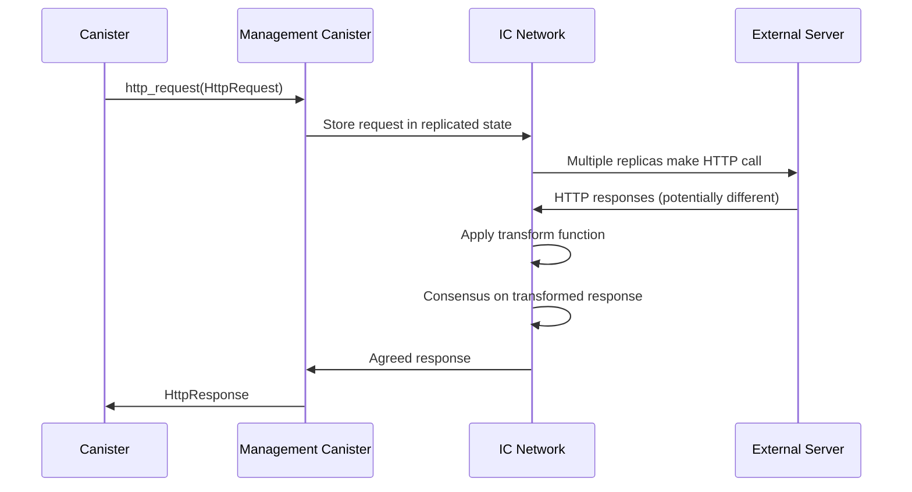

# ICP HTTP Outcall Nim実装仕様書

## 概要

本文書は、Internet Computer Protocol (ICP) のHTTP Outcall機能をNim言語で実装するための包括的な仕様書です。既存のNim CDK (`nicp_cdk`) の設計パターンに従い、マネジメントキャニスター経由でのHTTP通信機能を提供します。

## 1. 背景と目的

### 1.1 ICP HTTP Outcallの概要

HTTP Outcallは、ICPキャニスターが外部のHTTPサーバーと直接通信できる機能です。従来のオラクルサービスに代わり、より信頼性が高く低レイテンシーな外部データ取得を可能にします。

### 1.2 主要特徴

- **マネジメントキャニスター経由**: Principal `aaaaa-aa` を通じたシステムレベルAPI
- **コンセンサスベース**: 複数レプリカによる結果の合意形成
- **Transform関数**: レスポンスの正規化による決定論的実行
- **IPv6/IPv4対応**: 直接接続とSOCKSプロキシのフォールバック機構
- **サイクルベース課金**: リクエストサイズに応じた明示的な課金

### 1.3 実装目標

1. **型安全性**: CandidRecord型システムとの統合
2. **非同期サポート**: 既存のFuture[T]ベース設計の踏襲
3. **使いやすさ**: HTTPメソッド別の便利関数提供
4. **エラーハンドリング**: 包括的なエラー分類と処理
5. **Transform機能**: レスポンス正規化の完全サポート

## 2. アーキテクチャ設計

### 2.1 実装構造

```
nicp_cdk/
├── canisters/
│   └── management_canister.nim    # HTTP Outcall実装 (既存)
├── ic_types/
│   ├── http_types.nim            # HTTP型定義
│   └── ic_record.nim             # CandidRecord統合
└── utils/
    └── http_utils.nim            # HTTP便利関数
```

### 2.2 マネジメントキャニスター通信フロー



### 2.3 主要コンポーネント

1. **型定義**: HTTP関連のCandid対応型
2. **通信層**: ic0システムコールとのインターフェース
3. **Transform機能**: レスポンス正規化処理
4. **便利関数**: HTTPメソッド別のヘルパー
5. **エラー処理**: 包括的なエラーハンドリング

## 3. ローカル開発環境でのHTTP Outcall

### 3.1 ローカル環境での制限事項

ローカルdfx環境では、HTTP Outcall機能に以下の制限があります：

#### 3.1.1 デフォルトの制限

**重要な理解**:
- HTTP Outcall機能は**dfx 0.28.0でデフォルト有効**
- `--enable-canister-http`オプションは**非推奨**（警告表示）
- しかし、ローカル環境では**外部ネットワークアクセスが制限**

**制限内容**:
- ローカルdfxレプリカではHTTP Outcall機能は**完全にサンドボックス化**
- **外部サイト**（https://httpbin.orgなど）: IC0406エラー ❌
- **localhost**（http://localhost:8000）: IC0406エラー ❌  
- **同一ネットワーク**（192.168.x.x）: IC0406エラー ❌
- Management CanisterがHTTPリクエストを自動的にリジェクト（エラーコード: IC0406）
- セキュリティ上の理由による**全ての外部通信制限**
- 機能自体は動作するが、実際のHTTP通信は拒否される

#### 3.1.2 制限の背景

1. **セキュリティ**: ローカル開発環境での意図しない外部通信を防止
2. **一貫性**: 決定論的実行環境の維持
3. **ネットワーク分離**: 開発環境と本番環境の明確な分離

### 3.2 ローカルでHTTP Outcallを有効にする方法

#### 3.2.1 dfx.json設定

プロジェクトの`dfx.json`にHTTP Outcall設定を追加：

```json
{
  "canisters": {
    "your_canister": {
      "type": "motoko",
      "main": "src/main.mo"
    }
  },
  "defaults": {
    "canister_http": {
      "enabled": true,
      "log_level": "debug"
    },
    "replica": {
      "subnet_type": "system"
    }
  },
  "networks": {
    "local": {
      "bind": "127.0.0.1:4943",
      "type": "ephemeral",
      "canister_http": {
        "enabled": true
      }
    }
  }
}
```

#### 3.2.2 dfx startコマンドオプション

ローカルレプリカを起動（HTTP Outcallはデフォルトで有効）：

```bash
# 基本的な起動（HTTP Outcallはデフォルトで有効）
dfx start

# クリーンスタート（推奨）
dfx start --clean

# バックグラウンドで起動
dfx start --clean --background

# 詳細ログを有効化
dfx start --replica-log-level debug
```

#### 3.2.3 環境変数設定

```bash
# 詳細ログを有効化
export DFX_LOG_LEVEL=debug

# 必要に応じてHTTP Outcallを無効化する場合
# export DFX_CANISTER_HTTP_ENABLED=false
```

### 3.3 ローカルHTTP Outcallのテスト方法

#### 3.3.1 テスト用ローカルサーバーの設定

```bash
# HTTPテストサーバーを起動
python3 -m http.server 8080 &

# テスト用JSONファイルを作成
echo '{"message": "Hello from local server", "timestamp": "2024-01-01T00:00:00Z"}' > test.json

# アクセステスト
curl http://localhost:8080/test.json
```

#### 3.3.2 ローカルエンドポイントへのテスト

```nim
# ローカルHTTPサーバーへのテスト
proc testLocalHttpOutcall*() {.async.} =
  try:
    let response = await ManagementCanister.httpGet(
      "http://localhost:8080/test.json",
      headers = @[("Content-Type", "application/json")]
    )
    
    if response.isSuccess():
      echo "Local HTTP Outcall successful: ", response.getTextBody()
    else:
      echo "HTTP error: ", response.status
  except Exception as e:
    echo "Error: ", e.msg
```

#### 3.3.3 パブリックAPIテスト

```nim
# パブリックAPIへのテスト（プロキシ使用可能）
proc testPublicApiCall*() {.async.} =
  try:
    # IPv6対応のパブリックAPI
    let response = await ManagementCanister.httpGet(
      "https://httpbin.org/json",
      maxResponseBytes = some(4096)
    )
    
    echo "Public API response: ", response.getTextBody()
  except Exception as e:
    echo "Public API error: ", e.msg
```

### 3.4 ローカル開発のベストプラクティス

#### 3.4.1 段階的開発アプローチ

1. **Phase 1**: ローカルHTTPサーバーでテスト
2. **Phase 2**: dfx設定でHTTP Outcall有効化
3. **Phase 3**: パブリックAPIでの統合テスト
4. **Phase 4**: IC testnetでの検証

#### 3.4.2 テスト設定ファイル

`test-config.json`:
```json
{
  "httpOutcall": {
    "enabled": true,
    "localServer": "http://localhost:8080",
    "testEndpoints": [
      "https://httpbin.org/json",
      "https://api.github.com/zen"
    ]
  }
}
```

#### 3.4.3 デバッグコマンド

```bash
# HTTP Outcall設定確認
dfx canister status --all

# ネットワーク設定確認
dfx info networks

# dfx設定確認
dfx info

# キャニスターログ確認
dfx canister logs your_canister
```

### 3.5 トラブルシューティング

#### 3.5.1 よくある問題と解決策

| 問題 | 原因 | 解決策 |
|------|------|--------|
| IC0406 エラー | ローカル環境での外部通信制限 | 本番環境での検証、またはローカルサーバー使用 |
| `--enable-canister-http`警告 | 非推奨オプション使用 | オプション削除（デフォルト有効） |
| ネットワーク接続エラー | IPv6/IPv4設定 | ローカルサーバーまたはプロキシ使用 |
| Transform関数エラー | レスポンス不一致 | Transform関数の正規化ロジック確認 |
| タイムアウト | ネットワーク遅延 | タイムアウト設定の調整 |

#### 3.5.2 デバッグログの活用

```bash
# 詳細ログでdfx起動
dfx start --replica-log-level debug

# キャニスターとレプリカのログを監視
tail -f ~/.local/share/dfx/network/local/replica.log
```

#### 3.5.3 設定の検証

```bash
# dfx設定確認
dfx info

# ネットワーク設定確認
dfx ping local

# HTTP Outcall機能確認
dfx canister call your_canister test_http_outcall
```

## 4. 型定義仕様

### 4.1 基本HTTP型

```nim
type
  HttpMethod* {.pure.} = enum
    GET = "GET"
    POST = "POST"
    HEAD = "HEAD"
    PUT = "PUT"
    DELETE = "DELETE"
    PATCH = "PATCH"
    OPTIONS = "OPTIONS"

  HttpHeader* = tuple[name: string, value: string]

  HttpRequest* = object
    url*: string                              # RFC-3986準拠URL (最大8192文字)
    max_response_bytes*: Option[uint64]       # 最大2MB、未指定時はデフォルト2MB
    headers*: seq[HttpHeader]                 # HTTPリクエストヘッダー
    body*: Option[seq[uint8]]                 # リクエストボディ (オプション)
    httpMethod*: HttpMethod                   # HTTPメソッド
    transform*: Option[HttpTransform]         # Transform関数 (オプション)

  HttpResponse* = object
    status*: uint64                           # HTTPステータスコード
    headers*: seq[HttpHeader]                 # HTTPレスポンスヘッダー
    body*: seq[uint8]                         # レスポンスボディ

  HttpTransformFunction* = proc(response: HttpResponse): HttpResponse {.nimcall.}

  HttpTransform* = object
    function*: HttpTransformFunction          # Transform関数
    context*: seq[uint8]                      # Transform関数用コンテキスト
```

### 4.2 CandidRecord統合

```nim
# HttpRequestのCandidRecord変換
proc `%`*(request: HttpRequest): CandidRecord =
  result = %* {
    "url": request.url,
    "max_response_bytes": (
      if request.max_response_bytes.isSome: 
        some(request.max_response_bytes.get) 
      else: 
        none(uint64)
    ),
    "headers": request.headers.mapIt(%(it.name, it.value)),
    "body": request.body,
    "method": %(request.httpMethod),
    "transform": (
      if request.transform.isSome:
        some(%* {
          "function": %(request.transform.get.function),
          "context": request.transform.get.context
        })
      else:
        none(CandidRecord)
    )
  }

# HttpResponseのCandidRecord変換
proc candidValueToHttpResponse(candidValue: CandidValue): HttpResponse =
  let recordVal = candidValueToCandidRecord(candidValue)
  HttpResponse(
    status: recordVal["status"].getNat64(),
    headers: recordVal["headers"].getArray().mapIt(
      (it.getArray()[0].getStr(), it.getArray()[1].getStr())
    ),
    body: recordVal["body"].getBlob()
  )
```

### 4.3 エラー型定義

```nim
type
  HttpOutcallError* = object of CatchableError
    kind*: HttpOutcallErrorKind

  HttpOutcallErrorKind* {.pure.} = enum
    NetworkError       # 接続エラー
    TimeoutError       # タイムアウト
    ConsensusError     # コンセンサス失敗
    TransformError     # Transform関数エラー
    CyclesError        # サイクル不足
    ResponseTooLarge   # レスポンスサイズ超過
    InvalidUrl         # 不正なURL
    UnsupportedScheme  # サポートされていないスキーム
    ManagementCanisterError  # マネジメントキャニスターエラー
```

## 5. 実装仕様

### 5.1 基本HTTP Outcall実装

```nim
proc httpRequest*(request: HttpRequest): Future[HttpResponse] =
  ## HTTP Outcallをマネジメントキャニスター経由で実行
  result = newFuture[HttpResponse]("httpRequest")

  # マネジメントキャニスター (aaaaa-aa) への呼び出し
  let mgmtPrincipalBytes: seq[uint8] = @[]
  let destPtr = if mgmtPrincipalBytes.len > 0: mgmtPrincipalBytes[0].addr else: nil
  let destLen = mgmtPrincipalBytes.len

  let methodName = "http_request".cstring
  ic0_call_new(
    callee_src = cast[int](destPtr),
    callee_size = destLen,
    name_src = cast[int](methodName),
    name_size = methodName.len,
    reply_fun = cast[int](onHttpRequestSuccess),
    reply_env = cast[int](result),
    reject_fun = cast[int](onHttpRequestReject),
    reject_env = cast[int](result)
  )

  try:
    # HttpRequestをCandid形式でエンコード
    let candidValue = newCandidRecord(request)
    let encoded = encodeCandidMessage(@[candidValue])
    ic0_call_data_append(ptrToInt(addr encoded[0]), encoded.len)
    
    let err = ic0_call_perform()
    if err != 0:
      fail(result, newException(HttpOutcallError, 
        "http_request call_perform failed with error: " & $err))
      return
  except Exception as e:
    fail(result, e)
    return
```

### 5.2 コールバック関数実装

```nim
proc onHttpRequestSuccess(env: uint32) {.exportc.} =
  ## HTTP Outcall成功時のコールバック
  let fut = cast[Future[HttpResponse]](env)
  if fut == nil or fut.finished:
    return
  
  try:
    let size = ic0_msg_arg_data_size()
    var buf = newSeq[uint8](size)
    ic0_msg_arg_data_copy(ptrToInt(addr buf[0]), 0, size)
    
    let decoded = decodeCandidMessage(buf)
    let httpResponse = candidValueToHttpResponse(decoded.values[0])
    complete(fut, httpResponse)
  except Exception as e:
    fail(fut, e)

proc onHttpRequestReject(env: uint32) {.exportc.} =
  ## HTTP Outcall失敗時のコールバック
  let fut = cast[Future[HttpResponse]](env)
  if fut == nil or fut.finished:
    return
  
  # レプリカが異なるレスポンスを受信した場合など
  let error = HttpOutcallError(
    kind: ConsensusError,
    msg: "HTTP request was rejected by the management canister"
  )
  fail(fut, error)
```

### 5.3 Transform関数サポート

```nim
proc createDefaultTransform*(): HttpTransform =
  ## デフォルトのTransform関数: ヘッダーからタイムスタンプを除去
  proc defaultTransform(response: HttpResponse): HttpResponse =
    var filteredHeaders: seq[HttpHeader] = @[]
    for header in response.headers:
      # 一般的な可変ヘッダーを除去
      if header.name.toLowerAscii notin [
        "date", "server", "x-request-id", "x-timestamp", 
        "set-cookie", "expires", "last-modified"
      ]:
        filteredHeaders.add(header)
    
    HttpResponse(
      status: response.status,
      headers: filteredHeaders,
      body: response.body
    )
  
  HttpTransform(
    function: defaultTransform,
    context: @[]
  )

proc createJsonTransform*(): HttpTransform =
  ## JSON専用Transform関数: JSONフィールドから可変部分を除去
  proc jsonTransform(response: HttpResponse): HttpResponse =
    if response.status != 200:
      return response
    
    try:
      # JSONパース（要JSON library実装）
      let jsonStr = response.body.toString()
      # タイムスタンプ、リクエストID等を除去
      # 実装詳細は省略
      response
    except:
      response
  
  HttpTransform(
    function: jsonTransform,
    context: @[]
  )
```

## 6. 便利関数API

### 6.1 HTTPメソッド別関数

```nim
proc httpGet*(url: string, 
              headers: seq[HttpHeader] = @[], 
              maxResponseBytes: Option[uint64] = none(uint64),
              transform: Option[HttpTransform] = none(HttpTransform)): Future[HttpResponse] =
  ## GETリクエストの実行
  let request = HttpRequest(
    url: url,
    httpMethod: HttpMethod.GET,
    headers: headers,
    body: none(seq[uint8]),
    max_response_bytes: maxResponseBytes,
    transform: if transform.isSome: transform else: some(createDefaultTransform())
  )
  return httpRequest(request)

proc httpPost*(url: string, 
               body: seq[uint8], 
               headers: seq[HttpHeader] = @[],
               maxResponseBytes: Option[uint64] = none(uint64),
               idempotencyKey: Option[string] = none(string),
               transform: Option[HttpTransform] = none(HttpTransform)): Future[HttpResponse] =
  ## POSTリクエストの実行
  var requestHeaders = headers
  
  # Idempotency Key の自動設定
  if idempotencyKey.isSome:
    requestHeaders.add(("Idempotency-Key", idempotencyKey.get))
  else:
    # UUIDライブラリが必要
    requestHeaders.add(("Idempotency-Key", generateUUID()))
  
  let request = HttpRequest(
    url: url,
    httpMethod: HttpMethod.POST,
    headers: requestHeaders,
    body: some(body),
    max_response_bytes: maxResponseBytes,
    transform: if transform.isSome: transform else: some(createDefaultTransform())
  )
  return httpRequest(request)

proc httpPostJson*(url: string, 
                   jsonBody: string,
                   headers: seq[HttpHeader] = @[],
                   maxResponseBytes: Option[uint64] = none(uint64),
                   idempotencyKey: Option[string] = none(string)): Future[HttpResponse] =
  ## JSON POSTリクエストの実行
  var requestHeaders = headers
  requestHeaders.add(("Content-Type", "application/json"))
  
  let bodyBytes = jsonBody.toBytes()
  return httpPost(url, bodyBytes, requestHeaders, maxResponseBytes, idempotencyKey, some(createJsonTransform()))
```

### 6.2 レスポンス処理便利関数

```nim
proc getTextBody*(response: HttpResponse): string =
  ## レスポンスボディをテキストとして取得
  result = ""
  for b in response.body:
    result.add(char(b))

proc isSuccess*(response: HttpResponse): bool =
  ## HTTPステータスが成功範囲(200-299)かチェック
  response.status >= 200 and response.status < 300

proc getHeader*(response: HttpResponse, name: string): Option[string] =
  ## 指定されたヘッダー値を取得
  for header in response.headers:
    if header.name.toLowerAscii == name.toLowerAscii:
      return some(header.value)
  return none(string)

proc expectJsonResponse*(response: HttpResponse): string =
  ## JSONレスポンスの期待値検証
  if not response.isSuccess():
    raise newException(HttpOutcallError, 
      "HTTP request failed with status: " & $response.status)
  
  let contentType = response.getHeader("content-type")
  if contentType.isNone or not contentType.get.contains("application/json"):
    raise newException(HttpOutcallError, 
      "Expected JSON response but got: " & contentType.get("unknown"))
  
  return response.getTextBody()
```

## 7. 使用例

### 7.1 基本的なGETリクエスト

```nim
import nicp_cdk/canisters/management_canister
import std/asyncfutures

proc fetchWeatherData*(): Future[string] {.async.} =
  try:
    # IPv6対応APIへのリクエスト（サイクルは自動計算・送信）
    let response = await ManagementCanister.httpGet(
      url = "https://api.weather.com/v1/current?city=Tokyo",
      maxResponseBytes = some(1024'u64)  # 1KB制限
    )
    
    if response.isSuccess():
      result = response.getTextBody()
    else:
      result = "Error: " & $response.status
  except Exception as e:
    result = "HTTP Outcall Error: " & e.msg
```

### 7.2 JSONを使ったPOSTリクエスト

```nim
proc submitUserData*(name: string, age: int): Future[bool] {.async.} =
  try:
    let jsonData = %* {
      "name": name,
      "age": age,
      "timestamp": epochTime()  # Transform関数で除去される
    }
    
    # サイクルは自動計算・送信されるため明示的な指定不要
    let response = await ManagementCanister.httpPostJson(
      url = "https://api.example.com/users",
      jsonBody = $jsonData,
      maxResponseBytes = some(512'u64)
    )
    
    result = response.isSuccess()
  except Exception:
    result = false
```

### 7.3 カスタムTransform関数

```nim
proc fetchCryptoPrices*(): Future[seq[float]] {.async.} =
  proc priceTransform(response: HttpResponse): HttpResponse =
    # 価格API特有のTransform処理
    if response.status == 200:
      let jsonStr = response.getTextBody()
      # 特定のタイムスタンプフィールドを正規化
      # 実装の詳細は省略
    response
  
  let transform = HttpTransform(
    function: priceTransform,
    context: @[]
  )
  
  # サイクルは自動計算・送信
  let response = await ManagementCanister.httpGet(
    url = "https://api.coinbase.com/v2/exchange-rates?currency=ICP",
    maxResponseBytes = some(2048'u64),
    transform = some(transform)
  )
  
  # JSON解析してfloat配列に変換
  # 実装詳細は省略
  result = @[42.0]
```

## 8. エラーハンドリング仕様

### 8.1 エラー分類

```nim
proc classifyHttpError*(err: Exception): HttpOutcallErrorKind =
  let msg = err.msg.toLowerAscii
  
  if "timeout" in msg:
    return TimeoutError
  elif "consensus" in msg or "replicas" in msg:
    return ConsensusError
  elif "cycles" in msg:
    return CyclesError
  elif "response too large" in msg or "exceeds limit" in msg:
    return ResponseTooLarge
  elif "connection refused" in msg or "connect error" in msg:
    return NetworkError
  elif "https scheme" in msg:
    return UnsupportedScheme
  elif "invalid url" in msg:
    return InvalidUrl
  else:
    return ManagementCanisterError

proc handleHttpOutcallError*(err: Exception): string =
  let kind = classifyHttpError(err)
  case kind:
  of NetworkError:
    "ネットワーク接続エラー。対象サーバーのIPv6対応を確認してください。"
  of TimeoutError:
    "リクエストタイムアウト。Transform関数が正しく実装されているか確認してください。"
  of ConsensusError:
    "レプリカ間でレスポンスの合意が取れませんでした。Transform関数を見直してください。"
  of CyclesError:
    "サイクルが不足しています。十分なサイクルを付与してリクエストしてください。"
  of ResponseTooLarge:
    "レスポンスサイズが上限を超えました。max_response_bytesを適切に設定してください。"
  else:
    "HTTP Outcallエラー: " & err.msg
```

### 8.2 リトライ機構

```nim
proc httpRequestWithRetry*(request: HttpRequest, 
                          maxRetries: int = 3,
                          backoffMs: int = 1000): Future[HttpResponse] {.async.} =
  var lastError: Exception
  
  for attempt in 0..<maxRetries:
    try:
      let response = await httpRequest(request)
      return response
    except HttpOutcallError as e:
      lastError = e
      case e.kind:
      of NetworkError, TimeoutError:
        # リトライ可能なエラー
        if attempt < maxRetries - 1:
          await sleepAsync(backoffMs * (attempt + 1))
          continue
      else:
        # リトライ不可能なエラー
        raise e
    except Exception as e:
      lastError = e
      if attempt < maxRetries - 1:
        await sleepAsync(backoffMs * (attempt + 1))
        continue
  
  raise lastError
```

## 9. パフォーマンス・課金考慮事項

### 9.1 サイクル送信方法の言語別比較

HTTP Outcallにサイクルを送信する方法は言語によって異なります：

#### 9.1.1 Motoko
Motokoでは**明示的にサイクルを追加**する必要があります：

```motoko
// 明示的なサイクル追加が必要
Cycles.add<s>(230_949_972_000);
let http_response : IC.http_request_result = await IC.http_request(http_request);
```

または `with cycles` 構文を使用：

```motoko
// with cycles構文でサイクル送信
let http_response : HttpResponsePayload = await (with cycles = 230_949_972_000) ic.http_request(http_request);
```

#### 9.1.2 Rust
Rustの`ic_cdk`では**自動的にサイクルが送信**されます：

```rust
// Rustでは自動的に必要なサイクルが送信される
match http_request(request).await {
    Ok((response,)) => {
        // レスポンス処理
    }
    Err((r, m)) => {
        // エラーハンドリング
    }
}
```

公式ドキュメントの注記：
> **Note: in Rust, `http_request()` already sends the cycles needed so no need for explicit Cycles.add() as in Motoko**

#### 9.1.3 Nimでの実装方針

Nimでは**Rust方式の自動サイクル送信**を採用します：

```nim
proc httpRequest*(_:type ManagementCanister, request: HttpRequest): Future[HttpResponse] =
  # 自動的にサイクルを計算・送信（Rust方式）
  let totalCycles = estimateHttpOutcallCost(request)
  let cyclesHigh = totalCycles shr 32
  let cyclesLow = totalCycles and 0xFFFFFFFF'u64
  ic0_call_cycles_add128(cyclesHigh, cyclesLow)
  
  # HTTP request実行
  # ...
```

**メリット**:
- 開発者がサイクル計算を意識する必要がない
- Rustとの一貫性のあるAPI設計
- ヒューマンエラーの削減

### 9.2 自動サイクル計算の実装

NimのHTTP Outcall実装では、**IC System API**を使用して正確なサイクル計算を行います：

```nim
proc estimateHttpOutcallCost(request: HttpRequest): uint64 =
  ## HTTP Outcallのサイクル使用量を正確に計算（IC System API使用）
  
  # リクエストサイズを計算
  var requestSize = request.url.len.uint64
  
  # ヘッダーサイズ
  for header in request.headers:
    requestSize += header[0].len.uint64 + header[1].len.uint64
  
  # ボディサイズ
  if request.body.isSome:
    requestSize += request.body.get.len.uint64
  
  # HTTPメソッド名のサイズ
  requestSize += ($request.httpMethod).len.uint64
  
  # Transform関数サイズ（概算）
  if request.transform.isSome:
    requestSize += 100
  
  let maxResponseSize = request.max_response_bytes.get(2000000'u64)
  
  # IC System APIを使用して正確なコスト計算
  var costBuffer: array[16, uint8]  # 128bit cycles用バッファ
  ic0_cost_http_request(requestSize, maxResponseSize, addr costBuffer[0])
  
  # 128bitコスト値をuint64に変換
  var exactCost: uint64 = 0
  for i in 0..<8:
    exactCost = exactCost or (uint64(costBuffer[i]) shl (i * 8))
  
  # 20%の安全マージンを追加
  return exactCost + (exactCost div 5)
```

#### 9.2.1 IC System APIの利点

- **正確な計算**: ICプロトコルの公式コスト計算式を使用
- **自動更新**: ICの料金体系変更に自動対応
- **最適化**: 不要な概算計算を排除
- **信頼性**: プロトコルレベルでの保証

この計算は`httpRequest`関数内で自動的に実行され、開発者は意識する必要がありません。
```

### 9.3 最適化推奨事項

```nim
const 
  RECOMMENDED_MAX_RESPONSE_SIZE* = 64_000_u64  # 64KB推奨
  MAXIMUM_RESPONSE_SIZE* = 2_000_000_u64       # 2MB上限
  RECOMMENDED_URL_LENGTH* = 2048               # URL長推奨上限

proc validateHttpRequest*(request: HttpRequest): Result[void, string] =
  ## リクエストの妥当性検証
  if request.url.len > 8192:
    return err("URL length exceeds maximum of 8192 characters")
  
  if request.url.len > RECOMMENDED_URL_LENGTH:
    return err("URL length exceeds recommended limit of 2048 characters")
  
  if request.max_response_bytes.isSome and 
     request.max_response_bytes.get > MAXIMUM_RESPONSE_SIZE:
    return err("max_response_bytes exceeds maximum of 2MB")
  
  if not request.url.startsWith("https://"):
    return err("Only HTTPS URLs are supported")
  
  return ok()
```

## 10. テスト仕様

### 10.1 単体テスト

```nim
import unittest
import nicp_cdk/canisters/management_canister

suite "HTTP Outcall Tests":
  test "HttpRequest CandidRecord conversion":
    let request = HttpRequest(
      url: "https://api.example.com/test",
      httpMethod: HttpMethod.GET,
      headers: @[("User-Agent", "NimCDK/1.0")],
      body: none(seq[uint8]),
      max_response_bytes: some(1024_u64),
      transform: none(HttpTransform)
    )
    
    let candidRecord = newCandidRecord(request)
    check candidRecord["url"].getStr() == "https://api.example.com/test"
    check candidRecord["method"].getStr() == "GET"

  test "HttpResponse parsing":
    let candidValue = candidValueFromJson("""
      {
        "status": 200,
        "headers": [["Content-Type", "application/json"]],
        "body": "eyJ0ZXN0IjoidmFsdWUifQ=="
      }
    """)
    
    let response = candidValueToHttpResponse(candidValue)
    check response.status == 200
    check response.headers[0] == ("Content-Type", "application/json")

  test "Error classification":
    let timeoutError = newException(ValueError, "Timeout expired")
    check classifyHttpError(timeoutError) == TimeoutError
    
    let consensusError = newException(ValueError, 
      "Canister http responses were different across replicas")
    check classifyHttpError(consensusError) == ConsensusError
```

### 10.2 統合テスト

```nim
# ICローカルレプリカ環境でのテスト
proc testHttpGetIntegration*() {.async.} =
  try:
    let response = await httpGet(
      url = "https://httpbin.org/get",
      maxResponseBytes = some(4096_u64)
    )
    
    assert response.isSuccess()
    assert response.getTextBody().contains("httpbin.org")
  except Exception as e:
    echo "Integration test failed: ", e.msg

proc testHttpPostIntegration*() {.async.} =
  let jsonData = """{"test": "value", "timestamp": 1234567890}"""
  
  try:
    let response = await httpPostJson(
      url = "https://httpbin.org/post",
      jsonBody = jsonData,
      maxResponseBytes = some(4096_u64)
    )
    
    assert response.isSuccess()
    let responseText = response.getTextBody()
    assert responseText.contains("test")
    assert responseText.contains("value")
  except Exception as e:
    echo "POST integration test failed: ", e.msg
```

## 11. 実装計画

### 11.1 Phase 1: 基盤実装
- [ ] HTTP型定義の拡張 (management_canister.nim)
- [ ] CandidRecord統合の完成
- [ ] 基本的なhttpRequest関数の実装
- [ ] コールバック処理の改善

### 11.2 Phase 2: Transform機能
- [ ] Transform関数インターフェースの実装
- [ ] デフォルトTransform関数の提供
- [ ] JSON専用Transform関数の実装
- [ ] Transform関数のテスト

### 11.3 Phase 3: 便利関数とエラーハンドリング
- [ ] HTTPメソッド別便利関数の実装
- [ ] エラー分類とハンドリングの実装
- [ ] リトライ機構の実装
- [ ] レスポンス処理便利関数の実装

### 11.4 Phase 4: 最適化とテスト
- [ ] サイクル計算機能の実装
- [ ] パフォーマンス最適化
- [ ] 包括的なテストスイートの作成
- [ ] ドキュメンテーションの完成

### 11.5 Phase 5: 高度な機能
- [ ] WebSocket風リアルタイム通信の実装検討
- [ ] マルチパートフォームデータのサポート
- [ ] 認証ヘルパー関数の実装
- [ ] 課金最適化ツールの提供

## 12. 関連資料

### 12.1 ICP公式ドキュメント
- [HTTPS Outcalls仕様](https://internetcomputer.org/docs/references/https-outcalls-how-it-works)
- [Management Canister Interface](https://internetcomputer.org/docs/current/references/ic-interface-spec/#ic-management-canister)
- [HTTP Outcalls料金体系](https://internetcomputer.org/docs/current/developer-docs/gas-cost)
- [IC System API仕様（サイクル関連）](https://internetcomputer.org/docs/current/references/ic-interface-spec/#system-api-cycles)
- [IC HTTP Outcall コスト計算API](https://internetcomputer.org/docs/current/references/ic-interface-spec/#system-api-costs)

### 12.2 実装例

#### DFINITYサンプル実装
- [Rust HTTP Outcall実装](https://github.com/dfinity/examples/tree/master/rust/http_outcall)
- [Motoko HTTP Outcall実装](https://github.com/dfinity/examples/tree/master/motoko/http_outcall)
- [Motoko HTTP GET実装](https://github.com/dfinity/examples/tree/master/motoko/send_http_get)
- [Motoko HTTP POST実装](https://github.com/dfinity/examples/tree/master/motoko/send_http_post)

#### コミュニティ実装例
- [Motoko Outcalls Proxy](https://github.com/krpeacock/motoko-outcalls-proxy) - Kyle Peacock
- [Web I/O Library](https://github.com/NatLabs/web-io) - NatLabs高レベルAPI

#### 参考チュートリアル
- [HTTPS Outcalls Tutorial (ICP Docs)](https://internetcomputer.org/docs/tutorials/developer-liftoff/level-3/3.2-https-outcalls)
- [HTTPS Outcalls: POST Guide](https://internetcomputer.org/docs/building-apps/network-features/using-http/https-outcalls/post)

### 12.3 設計原則
- nicp_cdk既存設計パターンの踏襲
- CandidRecord型システムとの統合
- Future[T]ベース非同期処理の継続
- IC System APIとの一貫したインターフェース

---

本仕様書は、ICPのHTTP Outcall機能をNimで安全かつ効率的に利用するための包括的なガイドラインを提供します。実装時は段階的なアプローチを取り、各フェーズでのテストと検証を重視することで、信頼性の高いHTTP通信機能を実現します。
