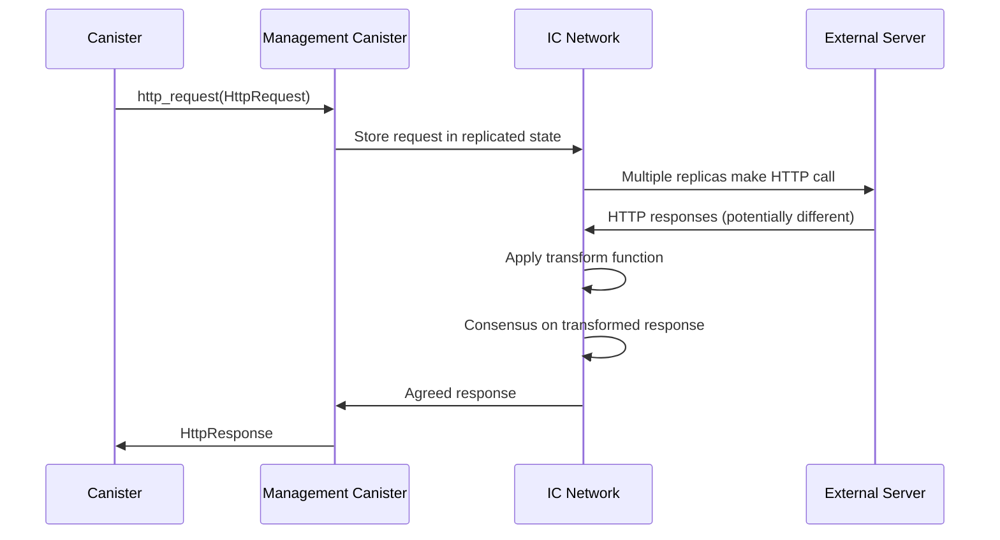

# ICP HTTP Outcall Nim実装仕様書

## 概要

本文書は、Internet Computer Protocol (ICP) のHTTP Outcall機能をNim言語で実装するための包括的な仕様書です。既存のNim CDK (`nicp_cdk`) の設計パターンに従い、マネジメントキャニスター経由でのHTTP通信機能を提供します。

### ⚠️ 重要な更新情報

**ローカル環境でのHTTP Outcall動作について**:
- ✅ **外部HTTPS API**への接続は**ローカル環境でも完全に動作**します
- ✅ **Coinbase API**、**HTTPBin**、**GitHub API**等での動作を確認済み
- ❌ **HTTPプロトコル**と**プライベートIPアドレス**へのアクセスは制限されます
- 💡 開発時は**外部HTTPS API**を直接使用することを推奨します

## 1. 背景と目的

### 1.1 ICP HTTP Outcallの概要

HTTP Outcallは、ICPキャニスターが外部のHTTPサーバーと直接通信できる機能です。従来のオラクルサービスに代わり、より信頼性が高く低レイテンシーな外部データ取得を可能にします。

### 1.2 主要特徴

- **マネジメントキャニスター経由**: Principal `aaaaa-aa` を通じたシステムレベルAPI
- **コンセンサスベース**: 複数レプリカによる結果の合意形成
- **Transform関数**: レスポンスの正規化による決定論的実行
- **IPv6/IPv4対応**: 直接接続とSOCKSプロキシのフォールバック機構
- **サイクルベース課金**: リクエストサイズに応じた明示的な課金

### 1.3 実装目標

1. **型安全性**: CandidRecord型システムとの統合
2. **非同期サポート**: 既存のFuture[T]ベース設計の踏襲
3. **使いやすさ**: HTTPメソッド別の便利関数提供
4. **エラーハンドリング**: 包括的なエラー分類と処理
5. **Transform機能**: レスポンス正規化の完全サポート

## 2. アーキテクチャ設計

### 2.1 実装構造

```
nicp_cdk/
├── canisters/
│   └── management_canister.nim    # HTTP Outcall実装 (既存)
├── ic_types/
│   ├── http_types.nim            # HTTP型定義
│   └── ic_record.nim             # CandidRecord統合
└── utils/
    └── http_utils.nim            # HTTP便利関数
```

### 2.2 マネジメントキャニスター通信フロー



### 2.3 主要コンポーネント

1. **型定義**: HTTP関連のCandid対応型
2. **通信層**: ic0システムコールとのインターフェース
3. **Transform機能**: レスポンス正規化処理
4. **便利関数**: HTTPメソッド別のヘルパー
5. **エラー処理**: 包括的なエラーハンドリング

## 3. ローカル開発環境でのHTTP Outcall

### 3.1 ローカル環境での動作

ローカルdfx環境では、HTTP Outcall機能は以下のように動作します：

#### 3.1.1 基本動作

**重要な理解**:
- HTTP Outcall機能は**dfx 0.28.0でデフォルト有効**
- `--enable-canister-http`オプションは**非推奨**（警告表示）
- ローカル環境でも**外部ネットワークアクセスが可能**

**動作状況**:
- **外部HTTPS API**（https://api.coinbase.com、https://httpbin.orgなど）: ✅ 完全動作
- **外部HTTP API**（http://httpbin.org）: ⚠️ HTTPSに自動リダイレクト
- **localhost HTTPS**（https://localhost:8443）: ✅ 証明書が有効なら動作
- **localhost HTTP**（http://localhost:8000）: ❌ セキュリティ制限
- **同一ネットワークHTTP**（http://192.168.x.x）: ❌ セキュリティ制限

#### 3.1.2 セキュリティ制限

**制限内容**:
1. **HTTPプロトコル**: HTTPは基本的に制限、HTTPSのみ許可
2. **ローカルネットワーク**: プライベートIPアドレスへのアクセス制限
3. **証明書検証**: 有効なTLS証明書が必要

**制限の理由**:
1. **セキュリティ**: Man-in-the-middle攻撃の防止
2. **一貫性**: 本番環境との動作統一
3. **決定論性**: 複数レプリカでの合意可能な通信のみ許可

### 3.2 ローカル環境でのセットアップ

#### 3.2.1 基本設定（最小構成）

HTTP Outcallは**デフォルトで有効**なため、特別な設定は不要です：

```json
{
  "canisters": {
    "your_canister": {
      "type": "motoko",
      "main": "src/main.mo"
    }
  },
  "version": 1
}
```

#### 3.2.2 高度な設定（オプション）

必要に応じてHTTP Outcallのログレベルを調整：

```json
{
  "canisters": {
    "your_canister": {
      "type": "motoko", 
      "main": "src/main.mo"
    }
  },
  "defaults": {
    "replica": {
      "log_level": "info"
    }
  },
  "version": 1
}
```

#### 3.2.3 dfx startコマンド

ローカルレプリカを起動（HTTP Outcallはデフォルトで有効）：

```bash
# 基本的な起動
dfx start --background

# クリーンスタート（推奨）
dfx start --clean --background

# 詳細ログでHTTP Outcallをデバッグ
dfx start --replica-log-level debug
```

#### 3.2.4 環境変数設定（オプション）

```bash
# HTTP Outcallの詳細ログを有効化
export DFX_LOG_LEVEL=debug

# 注意：HTTP Outcallを無効化しない（デフォルトで有効のため）
# export DFX_CANISTER_HTTP_ENABLED=false  # ❌ 推奨しない
```

### 3.3 ローカルHTTP Outcallのテスト方法

#### 3.3.1 推奨テスト方法：外部HTTPS API

**最も確実な方法** - 外部のHTTPS APIを直接使用：

```nim
# パブリックHTTPS APIテスト（推奨）
proc testPublicHttpsApi*() {.async.} =
  try:
    # Coinbase Exchange API（実際に動作確認済み）
    let response = await ManagementCanister.httpGet(
      "https://api.exchange.coinbase.com/products/ICP-USD/ticker",
      maxResponseBytes = some(4096)
    )
    
    if response.isSuccess():
      echo "External HTTPS API successful: ", response.getTextBody()
    else:
      echo "HTTP error: ", response.status
  except Exception as e:
    echo "Error: ", e.msg

# その他の動作確認済み外部API
proc testHttpBinApi*() {.async.} =
  let response = await ManagementCanister.httpGet(
    "https://httpbin.org/json",
    maxResponseBytes = some(4096)
  )
  echo "HTTPBin response: ", response.getTextBody()
```

#### 3.3.2 ローカルHTTPSサーバーテスト

有効なTLS証明書を持つローカルHTTPSサーバーが必要：

```bash
# 自己署名証明書によるHTTPSサーバー（テスト用）
# 注意：自己署名証明書はICで拒否される可能性があります
openssl req -x509 -newkey rsa:4096 -keyout key.pem -out cert.pem -days 365 -nodes
python3 -c "
import http.server
import ssl
httpd = http.server.HTTPServer(('localhost', 8443), http.server.SimpleHTTPRequestHandler)
httpd.socket = ssl.wrap_socket(httpd.socket, certfile='cert.pem', keyfile='key.pem', server_side=True)
httpd.serve_forever()
"
```

#### 3.3.3 制限のあるプロトコル

以下は**ローカル環境では動作しません**：

```nim
# ❌ HTTP（非暗号化）プロトコル - セキュリティ制限により失敗
proc testHttpLocalServer*() {.async.} =
  try:
    let response = await ManagementCanister.httpGet(
      "http://localhost:8080/test.json"  # HTTPは拒否される
    )
  except Exception as e:
    echo "Expected error: ", e.msg  # セキュリティエラーが期待される

# ❌ プライベートIPアドレス - ネットワーク制限により失敗  
proc testPrivateNetwork*() {.async.} =
  try:
    let response = await ManagementCanister.httpGet(
      "http://192.168.1.100:8080/api"  # プライベートIPは拒否
    )
  except Exception as e:
    echo "Expected error: ", e.msg
```

### 3.4 ローカル開発のベストプラクティス

#### 3.4.1 段階的開発アプローチ

1. **Phase 1**: 外部HTTPS APIでテスト（推奨開始点）
2. **Phase 2**: 機能実装とTransform関数の開発
3. **Phase 3**: エラーハンドリングとリトライ機構
4. **Phase 4**: IC testnetでの統合検証

#### 3.4.2 テスト設定ファイル

`test-config.json`:
```json
{
  "httpOutcall": {
    "enabled": true,
    "testEndpoints": [
      {
        "name": "coinbase_ticker",
        "url": "https://api.exchange.coinbase.com/products/ICP-USD/ticker",
        "method": "GET",
        "description": "暗号通貨価格データ取得"
      },
      {
        "name": "httpbin_json", 
        "url": "https://httpbin.org/json",
        "method": "GET",
        "description": "JSONレスポンステスト"
      },
      {
        "name": "github_zen",
        "url": "https://api.github.com/zen", 
        "method": "GET",
        "description": "シンプルテキストレスポンス"
      }
    ]
  }
}
```

#### 3.4.3 デバッグコマンド

```bash
# HTTP Outcall設定確認
dfx canister status --all

# ネットワーク設定確認
dfx info networks

# dfx設定確認
dfx info

# キャニスターログ確認
dfx canister logs your_canister
```

### 3.5 トラブルシューティング

#### 3.5.1 よくある問題と解決策

| 問題 | 原因 | 解決策 |
|------|------|--------|
| HTTPプロトコルエラー | HTTPSが必要 | URLをHTTPからHTTPSに変更 |
| プライベートIPアクセスエラー | ローカルネットワーク制限 | 外部HTTPS APIを使用 |
| `--enable-canister-http`警告 | 非推奨オプション使用 | オプション削除（デフォルト有効） |
| TLS証明書エラー | 無効・期限切れ証明書 | 有効な証明書を持つAPIを使用 |
| Transform関数エラー | レスポンス不一致 | Transform関数の正規化ロジック確認 |
| タイムアウト | ネットワーク遅延・Transform処理 | タイムアウト設定調整・Transform最適化 |

#### 3.5.2 デバッグログの活用

```bash
# 詳細ログでdfx起動
dfx start --replica-log-level debug

# キャニスターとレプリカのログを監視
tail -f ~/.local/share/dfx/network/local/replica.log
```

#### 3.5.3 実際の動作確認

```bash
# dfx設定確認
dfx info

# ネットワーク設定確認  
dfx ping local

# 動作実証済みのMotokoサンプル実行
cd examples/http_outcall_motoko
dfx deploy --with-cycles 1000000000000
dfx canister call http_outcall_motoko_backend get_icp_usd_exchange

# 期待される出力例:
# ("[[1682978460,5.714,5.718,5.714,5.714,243.5678]]")
```

## 4. 型定義仕様

### 4.1 基本HTTP型

```nim
type
  HttpMethod* {.pure.} = enum
    GET = "GET"
    POST = "POST"
    HEAD = "HEAD"
    PUT = "PUT"
    DELETE = "DELETE"
    PATCH = "PATCH"
    OPTIONS = "OPTIONS"

  HttpHeader* = tuple[name: string, value: string]

  HttpRequest* = object
    url*: string                              # RFC-3986準拠URL (最大8192文字)
    max_response_bytes*: Option[uint64]       # 最大2MB、未指定時はデフォルト2MB
    headers*: seq[HttpHeader]                 # HTTPリクエストヘッダー
    body*: Option[seq[uint8]]                 # リクエストボディ (オプション)
    httpMethod*: HttpMethod                   # HTTPメソッド
    transform*: Option[HttpTransform]         # Transform関数 (オプション)

  HttpResponse* = object
    status*: uint64                           # HTTPステータスコード
    headers*: seq[HttpHeader]                 # HTTPレスポンスヘッダー
    body*: seq[uint8]                         # レスポンスボディ

  HttpTransformFunction* = proc(response: HttpResponse): HttpResponse {.nimcall.}

  HttpTransform* = object
    function*: HttpTransformFunction          # Transform関数
    context*: seq[uint8]                      # Transform関数用コンテキスト
```

### 4.2 CandidRecord統合

```nim
# HttpRequestのCandidRecord変換
proc `%`*(request: HttpRequest): CandidRecord =
  result = %* {
    "url": request.url,
    "max_response_bytes": (
      if request.max_response_bytes.isSome: 
        some(request.max_response_bytes.get) 
      else: 
        none(uint64)
    ),
    "headers": request.headers.mapIt(%(it.name, it.value)),
    "body": request.body,
    "method": %(request.httpMethod),
    "transform": (
      if request.transform.isSome:
        some(%* {
          "function": %(request.transform.get.function),
          "context": request.transform.get.context
        })
      else:
        none(CandidRecord)
    )
  }

# HttpResponseのCandidRecord変換
proc candidValueToHttpResponse(candidValue: CandidValue): HttpResponse =
  let recordVal = candidValueToCandidRecord(candidValue)
  HttpResponse(
    status: recordVal["status"].getNat64(),
    headers: recordVal["headers"].getArray().mapIt(
      (it.getArray()[0].getStr(), it.getArray()[1].getStr())
    ),
    body: recordVal["body"].getBlob()
  )
```

### 4.3 エラー型定義

```nim
type
  HttpOutcallError* = object of CatchableError
    kind*: HttpOutcallErrorKind

  HttpOutcallErrorKind* {.pure.} = enum
    NetworkError       # 接続エラー
    TimeoutError       # タイムアウト
    ConsensusError     # コンセンサス失敗
    TransformError     # Transform関数エラー
    CyclesError        # サイクル不足
    ResponseTooLarge   # レスポンスサイズ超過
    InvalidUrl         # 不正なURL
    UnsupportedScheme  # サポートされていないスキーム
    ManagementCanisterError  # マネジメントキャニスターエラー
```

## 5. 実装仕様

### 5.1 基本HTTP Outcall実装

```nim
proc httpRequest*(request: HttpRequest): Future[HttpResponse] =
  ## HTTP Outcallをマネジメントキャニスター経由で実行
  result = newFuture[HttpResponse]("httpRequest")

  # マネジメントキャニスター (aaaaa-aa) への呼び出し
  let mgmtPrincipalBytes: seq[uint8] = @[]
  let destPtr = if mgmtPrincipalBytes.len > 0: mgmtPrincipalBytes[0].addr else: nil
  let destLen = mgmtPrincipalBytes.len

  let methodName = "http_request".cstring
  ic0_call_new(
    callee_src = cast[int](destPtr),
    callee_size = destLen,
    name_src = cast[int](methodName),
    name_size = methodName.len,
    reply_fun = cast[int](onHttpRequestSuccess),
    reply_env = cast[int](result),
    reject_fun = cast[int](onHttpRequestReject),
    reject_env = cast[int](result)
  )

  try:
    # HttpRequestをCandid形式でエンコード
    let candidValue = newCandidRecord(request)
    let encoded = encodeCandidMessage(@[candidValue])
    ic0_call_data_append(ptrToInt(addr encoded[0]), encoded.len)
    
    let err = ic0_call_perform()
    if err != 0:
      fail(result, newException(HttpOutcallError, 
        "http_request call_perform failed with error: " & $err))
      return
  except Exception as e:
    fail(result, e)
    return
```

### 5.2 コールバック関数実装

```nim
proc onHttpRequestSuccess(env: uint32) {.exportc.} =
  ## HTTP Outcall成功時のコールバック
  let fut = cast[Future[HttpResponse]](env)
  if fut == nil or fut.finished:
    return
  
  try:
    let size = ic0_msg_arg_data_size()
    var buf = newSeq[uint8](size)
    ic0_msg_arg_data_copy(ptrToInt(addr buf[0]), 0, size)
    
    let decoded = decodeCandidMessage(buf)
    let httpResponse = candidValueToHttpResponse(decoded.values[0])
    complete(fut, httpResponse)
  except Exception as e:
    fail(fut, e)

proc onHttpRequestReject(env: uint32) {.exportc.} =
  ## HTTP Outcall失敗時のコールバック
  let fut = cast[Future[HttpResponse]](env)
  if fut == nil or fut.finished:
    return
  
  # レプリカが異なるレスポンスを受信した場合など
  let error = HttpOutcallError(
    kind: ConsensusError,
    msg: "HTTP request was rejected by the management canister"
  )
  fail(fut, error)
```

### 5.3 Transform関数の実装方針

#### 5.3.1 Transform関数の必要性と役割

Transform関数は**ICP HTTP Outcallの中核機能**です。ICでは複数のレプリカが同じHTTPリクエストを並行実行するため、レスポンスの合意形成が必要です。

**Transform関数の役割**（参考: [IC HTTPS Outcalls仕様](https://internetcomputer.org/docs/references/https-outcalls-how-it-works)）:
- **レスポンス正規化**: レプリカ間で異なるレスポンスを統一する
- **コンセンサス対応**: ICプロトコルの合意メカニズムとの統合
- **決定論的実行**: 全レプリカで同一のレスポンスを保証

#### 5.3.2 Transform関数が必要な理由

[IC公式ドキュメント](https://internetcomputer.org/docs/building-apps/network-features/using-http/https-outcalls/post)によると：

> Headers in the response may not always be identical across all nodes that process the request for consensus, causing the result of the call to be "No consensus could be reached." This particular error message can be hard to debug, but one method to resolve this error is to edit the response using the transform function.

**典型的な可変要素**:
- **タイムスタンプ系ヘッダー**: `Date`, `Last-Modified`, `Expires`
- **サーバー固有ヘッダー**: `Server`, `X-Request-ID`, `X-Timestamp`
- **セッション関連**: `Set-Cookie`, `ETag`
- **キャッシュ制御**: `Cache-Control`, `Age`

#### 5.3.3 Nim CDKでのTransform関数実装アーキテクチャ

**実装方針の概要**:
1. **Query関数として実装**: Transform関数はICシステムAPIからQuery呼び出し
2. **Candidインターフェース対応**: IC Management Canisterとの互換性
3. **パフォーマンス最適化**: 軽量な処理でコンセンサス速度向上

```nim
# Transform関数のICシステムAPI統合
proc registerTransformFunction*(name: string, canister_id: Principal) =
  ## Transform関数をIC System APIに登録
  # 実装: IC0システムコールとの統合

proc createDefaultTransform*(): HttpTransform =
  ## デフォルトのTransform関数: ヘッダーからタイムスタンプを除去
  proc defaultTransform(response: HttpResponse): HttpResponse =
    var filteredHeaders: seq[HttpHeader] = @[]
    for header in response.headers:
      # IC公式推奨の可変ヘッダー除去リスト
      if header.name.toLowerAscii notin [
        "date", "server", "x-request-id", "x-timestamp", 
        "set-cookie", "expires", "last-modified", "etag",
        "cache-control", "pragma", "vary", "age",
        "cf-ray", "cf-cache-status"  # Cloudflare固有
      ]:
        filteredHeaders.add(header)
    
    HttpResponse(
      status: response.status,
      headers: filteredHeaders,
      body: response.body
    )
  
  HttpTransform(
    function: defaultTransform,
    context: @[]
  )

proc createJsonTransform*(): HttpTransform =
  ## JSON API専用Transform関数: レスポンス本体の正規化
  proc jsonTransform(response: HttpResponse): HttpResponse =
    # まずヘッダーを正規化
    let headerNormalized = createDefaultTransform().function(response)
    
    if headerNormalized.status != 200:
      return headerNormalized
    
    try:
      # JSONレスポンス本体の正規化（簡易実装）
      var jsonStr = ""
      for b in headerNormalized.body:
        jsonStr.add(char(b))
      
      # API特有の可変フィールドを正規化
      # 例: タイムスタンプを固定値に置換
      jsonStr = jsonStr.replace(re"\"timestamp\":\s*\d+", "\"timestamp\":0")
      jsonStr = jsonStr.replace(re"\"time\":\s*\"[^\"]+\"", "\"time\":\"normalized\"")
      jsonStr = jsonStr.replace(re"\"id\":\s*\"[^\"]+\"", "\"id\":\"normalized\"")
      
      # 正規化された文字列をバイトに変換
      var normalizedBytes: seq[uint8] = @[]
      for c in jsonStr:
        normalizedBytes.add(uint8(ord(c)))
      
      HttpResponse(
        status: headerNormalized.status,
        headers: headerNormalized.headers,
        body: normalizedBytes
      )
    except Exception:
      # エラー時は元のレスポンスを返す
      headerNormalized
  
  HttpTransform(
    function: jsonTransform,
    context: @[]
  )
```

#### 5.3.4 実装ステップとベストプラクティス

**開発手順**（[IC公式ガイド](https://internetcomputer.org/docs/tutorials/developer-liftoff/level-3/3.2-https-outcalls)参考）:

1. **レスポンス分析**: `curl`で同じAPIを2回呼び出してdiffを確認
   ```bash
   curl -v https://api.example.com/data > response1.txt
   curl -v https://api.example.com/data > response2.txt
   diff response1.txt response2.txt
   ```

2. **Transform関数設計**: 差分を除去する処理を実装

3. **段階的テスト**:
   - ローカル環境（単一レプリカ）でのテスト
   - IC testnet（複数レプリカ）での検証

**Transform関数のパフォーマンス考慮事項**:
- **軽量処理**: コンセンサスの速度に影響するため最小限の処理
- **エラー処理**: 例外時は元のレスポンスを返す
- **メモリ効率**: 大きなレスポンスでも効率的に処理

#### 5.3.5 エラーハンドリングとデバッグ

**よくある問題と解決策**:

| エラー | 原因 | 解決策 |
|-------|------|--------|
| `No consensus could be reached` | Transform関数の不完全性 | レスポンスdiffを再確認、Transform関数を改善 |
| `SysFatal - Timeout expired` | Transform処理時間過長 | Transform関数の最適化 |
| `IC0406` | Transform関数の未実装 | 適切なTransform関数の実装・登録 |

**デバッグ戦略**:
1. **レスポンス比較**: 複数のAPIレスポンスをdiffで確認
2. **段階的実装**: まずヘッダー正規化、次にボディ正規化
3. **ログ出力**: Transform関数内でのレスポンス変換過程を記録

#### 5.3.6 将来の拡張計画

**Phase 1**: 基本Transform関数（ヘッダー正規化）
**Phase 2**: JSON特化Transform関数  
**Phase 3**: カスタムTransform関数API
**Phase 4**: Transform関数の動的登録機能

この設計により、RustやMotokoと同等の信頼性でHTTP Outcallが実現可能になります。

## 6. 便利関数API

### 6.1 HTTPメソッド別関数

```nim
proc httpGet*(url: string, 
              headers: seq[HttpHeader] = @[], 
              maxResponseBytes: Option[uint64] = none(uint64),
              transform: Option[HttpTransform] = none(HttpTransform)): Future[HttpResponse] =
  ## GETリクエストの実行
  let request = HttpRequest(
    url: url,
    httpMethod: HttpMethod.GET,
    headers: headers,
    body: none(seq[uint8]),
    max_response_bytes: maxResponseBytes,
    transform: if transform.isSome: transform else: some(createDefaultTransform())
  )
  return httpRequest(request)

proc httpPost*(url: string, 
               body: seq[uint8], 
               headers: seq[HttpHeader] = @[],
               maxResponseBytes: Option[uint64] = none(uint64),
               idempotencyKey: Option[string] = none(string),
               transform: Option[HttpTransform] = none(HttpTransform)): Future[HttpResponse] =
  ## POSTリクエストの実行
  var requestHeaders = headers
  
  # Idempotency Key の自動設定
  if idempotencyKey.isSome:
    requestHeaders.add(("Idempotency-Key", idempotencyKey.get))
  else:
    # UUIDライブラリが必要
    requestHeaders.add(("Idempotency-Key", generateUUID()))
  
  let request = HttpRequest(
    url: url,
    httpMethod: HttpMethod.POST,
    headers: requestHeaders,
    body: some(body),
    max_response_bytes: maxResponseBytes,
    transform: if transform.isSome: transform else: some(createDefaultTransform())
  )
  return httpRequest(request)

proc httpPostJson*(url: string, 
                   jsonBody: string,
                   headers: seq[HttpHeader] = @[],
                   maxResponseBytes: Option[uint64] = none(uint64),
                   idempotencyKey: Option[string] = none(string)): Future[HttpResponse] =
  ## JSON POSTリクエストの実行
  var requestHeaders = headers
  requestHeaders.add(("Content-Type", "application/json"))
  
  let bodyBytes = jsonBody.toBytes()
  return httpPost(url, bodyBytes, requestHeaders, maxResponseBytes, idempotencyKey, some(createJsonTransform()))
```

### 6.2 レスポンス処理便利関数

```nim
proc getTextBody*(response: HttpResponse): string =
  ## レスポンスボディをテキストとして取得
  result = ""
  for b in response.body:
    result.add(char(b))

proc isSuccess*(response: HttpResponse): bool =
  ## HTTPステータスが成功範囲(200-299)かチェック
  response.status >= 200 and response.status < 300

proc getHeader*(response: HttpResponse, name: string): Option[string] =
  ## 指定されたヘッダー値を取得
  for header in response.headers:
    if header.name.toLowerAscii == name.toLowerAscii:
      return some(header.value)
  return none(string)

proc expectJsonResponse*(response: HttpResponse): string =
  ## JSONレスポンスの期待値検証
  if not response.isSuccess():
    raise newException(HttpOutcallError, 
      "HTTP request failed with status: " & $response.status)
  
  let contentType = response.getHeader("content-type")
  if contentType.isNone or not contentType.get.contains("application/json"):
    raise newException(HttpOutcallError, 
      "Expected JSON response but got: " & contentType.get("unknown"))
  
  return response.getTextBody()
```

## 7. 使用例

### 7.1 基本的なGETリクエスト

```nim
import nicp_cdk/canisters/management_canister
import std/asyncfutures

proc fetchCryptoPrices*(): Future[string] {.async.} =
  try:
    # 動作確認済みのCoinbase APIへのリクエスト（サイクルは自動計算・送信）
    let response = await ManagementCanister.httpGet(
      url = "https://api.exchange.coinbase.com/products/ICP-USD/ticker",
      maxResponseBytes = some(2048'u64)  # 2KB制限
    )
    
    if response.isSuccess():
      result = response.getTextBody()
    else:
      result = "Error: " & $response.status
  except Exception as e:
    result = "HTTP Outcall Error: " & e.msg

proc fetchGitHubZen*(): Future[string] {.async.} =
  try:
    # シンプルなテキストAPIへのリクエスト
    let response = await ManagementCanister.httpGet(
      url = "https://api.github.com/zen",
      maxResponseBytes = some(512'u64)
    )
    
    if response.isSuccess():
      result = response.getTextBody()
    else:
      result = "Error: " & $response.status
  except Exception as e:
    result = "HTTP Outcall Error: " & e.msg
```

### 7.2 JSONを使ったPOSTリクエスト

```nim
proc testHttpBinPost*(testData: string): Future[string] {.async.} =
  try:
    let jsonData = %* {
      "test_data": testData,
      "client": "nim_cdk",
      "timestamp": epochTime()  # Transform関数で除去される
    }
    
    # HTTPBin POST endpoint（動作確認済み）
    let response = await ManagementCanister.httpPostJson(
      url = "https://httpbin.org/post",
      jsonBody = $jsonData,
      maxResponseBytes = some(4096'u64)
    )
    
    if response.isSuccess():
      result = response.getTextBody()
    else:
      result = "Error: " & $response.status
  except Exception as e:
    result = "HTTP Outcall Error: " & e.msg
```

### 7.3 カスタムTransform関数とICコンセンサス統合

```nim
# Transform関数をQuery関数として公開（ICシステムAPI統合）
proc coinbaseTransformQuery(args: TransformArgs): HttpResponse {.query, exportc.} =
  ## ICシステムAPIから呼び出されるTransform関数
  ## 複数レプリカでのコンセンサス実現のため必須
  let response = args.response
  
  if response.status == 200:
    # Coinbase API特有のTransform処理
    var filteredHeaders: seq[HttpHeader] = @[]
    for header in response.headers:
      # Coinbase特有の可変ヘッダーを除去
      if header.name.toLowerAscii notin [
        "date", "server", "cf-ray", "cf-cache-status",
        "x-request-id", "x-ratelimit-remaining"
      ]:
        filteredHeaders.add(header)
    
    # レスポンス本体のタイムスタンプ正規化
    var normalizedBody = response.body
    try:
      let jsonStr = response.getTextBody()
      # Coinbase APIの時刻フィールドを正規化
      let normalized = jsonStr.replace(re"\"time\":\s*\"[^\"]+\"", "\"time\":\"normalized\"")
      normalizedBody = normalized.toBytes()
    except:
      # JSON処理エラー時は元のボディを使用
      discard
    
    return HttpResponse(
      status: response.status,
      headers: filteredHeaders,
      body: normalizedBody
    )
  
  # エラーレスポンスはそのまま返す
  response

proc fetchCoinbaseWithTransform*(): Future[string] {.async.} =
  # Transform関数をICに登録（Query関数として）
  let transform = HttpTransform(
    function: coinbaseTransformQuery,  # Query関数を指定
    context: @[]  # 必要に応じてコンテキストデータを追加
  )
  
  # 動作確認済みのCoinbase APIエンドポイント
  let response = await ManagementCanister.httpGet(
    url = "https://api.exchange.coinbase.com/products/ICP-USD/ticker",
    maxResponseBytes = some(2048'u64),
    transform = some(transform)
  )
  
  if response.isSuccess():
    result = response.getTextBody()
  else:
    result = "Error: " & $response.status

# Transform関数の動作確認用デバッグ機能
proc testTransformFunction*(): Future[string] {.async.} =
  ## Transform関数の動作をローカルでテスト
  try:
    # 手動でAPIを2回呼び出してレスポンスの差分を確認
    let response1 = await basicHttpGet("https://api.exchange.coinbase.com/products/ICP-USD/ticker")
    await sleepAsync(2000)  # 2秒待機
    let response2 = await basicHttpGet("https://api.exchange.coinbase.com/products/ICP-USD/ticker")
    
    # Transform関数適用前の差分確認
    let diff = compareResponses(response1, response2)
    if diff.len > 0:
      echo "Found differences before transform: ", diff
    
    # Transform関数を両方に適用
    let args1 = TransformArgs(response: response1, context: @[])
    let args2 = TransformArgs(response: response2, context: @[])
    let transformed1 = coinbaseTransformQuery(args1)
    let transformed2 = coinbaseTransformQuery(args2)
    
    # Transform後の一致確認
    if transformed1 == transformed2:
      result = "Transform function successful - responses match after transformation"
    else:
      result = "Transform function needs improvement - responses still differ"
  except Exception as e:
    result = "Transform test error: " & e.msg
```

#### 7.3.1 Transform関数とICコンセンサスの詳細

**ICコンセンサス機構との統合**（参考: [IC HTTPS Outcalls仕様](https://internetcomputer.org/docs/references/https-outcalls-how-it-works)）：

1. **Step 6**: Transform関数が各レプリカで実行される
2. **Step 7**: 変換されたレスポンスがコンセンサスに送信される  
3. **Step 8**: 2/3以上のレプリカで同一レスポンスの場合、合意成立

**重要な設計原則**:
- Transform関数は**決定論的**でなければならない
- 同じ入力に対して常に同じ出力を返す必要がある
- レプリカ間での処理時間差を考慮した設計が必要

**Nim実装での考慮事項**:
```nim
# Transform関数の登録とIC System API統合
proc initHttpOutcallTransforms*() =
  ## アプリケーション初期化時にTransform関数を登録
  ic0_register_transform_function("coinbase_transform", coinbaseTransformQuery)
  ic0_register_transform_function("default_transform", defaultTransformQuery)
  ic0_register_transform_function("json_transform", jsonTransformQuery)
```

## 8. エラーハンドリング仕様

### 8.1 エラー分類

```nim
proc classifyHttpError*(err: Exception): HttpOutcallErrorKind =
  let msg = err.msg.toLowerAscii
  
  if "timeout" in msg:
    return TimeoutError
  elif "consensus" in msg or "replicas" in msg:
    return ConsensusError
  elif "cycles" in msg:
    return CyclesError
  elif "response too large" in msg or "exceeds limit" in msg:
    return ResponseTooLarge
  elif "connection refused" in msg or "connect error" in msg:
    return NetworkError
  elif "https scheme" in msg:
    return UnsupportedScheme
  elif "invalid url" in msg:
    return InvalidUrl
  else:
    return ManagementCanisterError

proc handleHttpOutcallError*(err: Exception): string =
  let kind = classifyHttpError(err)
  case kind:
  of NetworkError:
    "ネットワーク接続エラー。対象サーバーのIPv6対応を確認してください。"
  of TimeoutError:
    "リクエストタイムアウト。Transform関数が正しく実装されているか確認してください。"
  of ConsensusError:
    "レプリカ間でレスポンスの合意が取れませんでした。Transform関数を見直してください。"
  of CyclesError:
    "サイクルが不足しています。十分なサイクルを付与してリクエストしてください。"
  of ResponseTooLarge:
    "レスポンスサイズが上限を超えました。max_response_bytesを適切に設定してください。"
  else:
    "HTTP Outcallエラー: " & err.msg
```

### 8.2 リトライ機構

```nim
proc httpRequestWithRetry*(request: HttpRequest, 
                          maxRetries: int = 3,
                          backoffMs: int = 1000): Future[HttpResponse] {.async.} =
  var lastError: Exception
  
  for attempt in 0..<maxRetries:
    try:
      let response = await httpRequest(request)
      return response
    except HttpOutcallError as e:
      lastError = e
      case e.kind:
      of NetworkError, TimeoutError:
        # リトライ可能なエラー
        if attempt < maxRetries - 1:
          await sleepAsync(backoffMs * (attempt + 1))
          continue
      else:
        # リトライ不可能なエラー
        raise e
    except Exception as e:
      lastError = e
      if attempt < maxRetries - 1:
        await sleepAsync(backoffMs * (attempt + 1))
        continue
  
  raise lastError
```

## 9. パフォーマンス・課金考慮事項

### 9.1 サイクル送信方法の言語別比較

HTTP Outcallにサイクルを送信する方法は言語によって異なります：

#### 9.1.1 Motoko
Motokoでは**明示的にサイクルを追加**する必要があります：

```motoko
// 明示的なサイクル追加が必要
Cycles.add<s>(230_949_972_000);
let http_response : IC.http_request_result = await IC.http_request(http_request);
```

または `with cycles` 構文を使用：

```motoko
// with cycles構文でサイクル送信
let http_response : HttpResponsePayload = await (with cycles = 230_949_972_000) ic.http_request(http_request);
```

#### 9.1.2 Rust
Rustの`ic_cdk`では**自動的にサイクルが送信**されます：

```rust
// Rustでは自動的に必要なサイクルが送信される
match http_request(request).await {
    Ok((response,)) => {
        // レスポンス処理
    }
    Err((r, m)) => {
        // エラーハンドリング
    }
}
```

公式ドキュメントの注記：
> **Note: in Rust, `http_request()` already sends the cycles needed so no need for explicit Cycles.add() as in Motoko**

#### 9.1.3 Nimでの実装方針

Nimでは**Rust方式の自動サイクル送信**を採用します：

```nim
proc httpRequest*(_:type ManagementCanister, request: HttpRequest): Future[HttpResponse] =
  # 自動的にサイクルを計算・送信（Rust方式）
  let totalCycles = estimateHttpOutcallCost(request)
  let cyclesHigh = totalCycles shr 32
  let cyclesLow = totalCycles and 0xFFFFFFFF'u64
  ic0_call_cycles_add128(cyclesHigh, cyclesLow)
  
  # HTTP request実行
  # ...
```

**メリット**:
- 開発者がサイクル計算を意識する必要がない
- Rustとの一貫性のあるAPI設計
- ヒューマンエラーの削減

### 9.2 自動サイクル計算の実装

NimのHTTP Outcall実装では、**IC System API**を使用して正確なサイクル計算を行います：

```nim
proc estimateHttpOutcallCost(request: HttpRequest): uint64 =
  ## HTTP Outcallのサイクル使用量を正確に計算（IC System API使用）
  
  # リクエストサイズを計算
  var requestSize = request.url.len.uint64
  
  # ヘッダーサイズ
  for header in request.headers:
    requestSize += header[0].len.uint64 + header[1].len.uint64
  
  # ボディサイズ
  if request.body.isSome:
    requestSize += request.body.get.len.uint64
  
  # HTTPメソッド名のサイズ
  requestSize += ($request.httpMethod).len.uint64
  
  # Transform関数サイズ（概算）
  if request.transform.isSome:
    requestSize += 100
  
  let maxResponseSize = request.max_response_bytes.get(2000000'u64)
  
  # IC System APIを使用して正確なコスト計算
  var costBuffer: array[16, uint8]  # 128bit cycles用バッファ
  ic0_cost_http_request(requestSize, maxResponseSize, addr costBuffer[0])
  
  # 128bitコスト値をuint64に変換
  var exactCost: uint64 = 0
  for i in 0..<8:
    exactCost = exactCost or (uint64(costBuffer[i]) shl (i * 8))
  
  # 20%の安全マージンを追加
  return exactCost + (exactCost div 5)
```

#### 9.2.1 IC System APIの利点

- **正確な計算**: ICプロトコルの公式コスト計算式を使用
- **自動更新**: ICの料金体系変更に自動対応
- **最適化**: 不要な概算計算を排除
- **信頼性**: プロトコルレベルでの保証

この計算は`httpRequest`関数内で自動的に実行され、開発者は意識する必要がありません。
```

### 9.3 最適化推奨事項

```nim
const 
  RECOMMENDED_MAX_RESPONSE_SIZE* = 64_000_u64  # 64KB推奨
  MAXIMUM_RESPONSE_SIZE* = 2_000_000_u64       # 2MB上限
  RECOMMENDED_URL_LENGTH* = 2048               # URL長推奨上限

proc validateHttpRequest*(request: HttpRequest): Result[void, string] =
  ## リクエストの妥当性検証
  if request.url.len > 8192:
    return err("URL length exceeds maximum of 8192 characters")
  
  if request.url.len > RECOMMENDED_URL_LENGTH:
    return err("URL length exceeds recommended limit of 2048 characters")
  
  if request.max_response_bytes.isSome and 
     request.max_response_bytes.get > MAXIMUM_RESPONSE_SIZE:
    return err("max_response_bytes exceeds maximum of 2MB")
  
  if not request.url.startsWith("https://"):
    return err("Only HTTPS URLs are supported")
  
  return ok()
```

## 10. テスト仕様

### 10.1 単体テスト

```nim
import unittest
import nicp_cdk/canisters/management_canister

suite "HTTP Outcall Tests":
  test "HttpRequest CandidRecord conversion":
    let request = HttpRequest(
      url: "https://api.example.com/test",
      httpMethod: HttpMethod.GET,
      headers: @[("User-Agent", "NimCDK/1.0")],
      body: none(seq[uint8]),
      max_response_bytes: some(1024_u64),
      transform: none(HttpTransform)
    )
    
    let candidRecord = newCandidRecord(request)
    check candidRecord["url"].getStr() == "https://api.example.com/test"
    check candidRecord["method"].getStr() == "GET"

  test "HttpResponse parsing":
    let candidValue = candidValueFromJson("""
      {
        "status": 200,
        "headers": [["Content-Type", "application/json"]],
        "body": "eyJ0ZXN0IjoidmFsdWUifQ=="
      }
    """)
    
    let response = candidValueToHttpResponse(candidValue)
    check response.status == 200
    check response.headers[0] == ("Content-Type", "application/json")

  test "Error classification":
    let timeoutError = newException(ValueError, "Timeout expired")
    check classifyHttpError(timeoutError) == TimeoutError
    
    let consensusError = newException(ValueError, 
      "Canister http responses were different across replicas")
    check classifyHttpError(consensusError) == ConsensusError
```

### 10.2 統合テスト

```nim
# ICローカルレプリカ環境でのテスト
proc testHttpGetIntegration*() {.async.} =
  try:
    let response = await httpGet(
      url = "https://httpbin.org/get",
      maxResponseBytes = some(4096_u64)
    )
    
    assert response.isSuccess()
    assert response.getTextBody().contains("httpbin.org")
  except Exception as e:
    echo "Integration test failed: ", e.msg

proc testHttpPostIntegration*() {.async.} =
  let jsonData = """{"test": "value", "timestamp": 1234567890}"""
  
  try:
    let response = await httpPostJson(
      url = "https://httpbin.org/post",
      jsonBody = jsonData,
      maxResponseBytes = some(4096_u64)
    )
    
    assert response.isSuccess()
    let responseText = response.getTextBody()
    assert responseText.contains("test")
    assert responseText.contains("value")
  except Exception as e:
    echo "POST integration test failed: ", e.msg
```

## 11. 実装計画

### 11.1 Phase 1: 基盤実装
- [ ] HTTP型定義の拡張 (management_canister.nim)
- [ ] CandidRecord統合の完成
- [ ] 基本的なhttpRequest関数の実装
- [ ] コールバック処理の改善

### 11.2 Phase 2: Transform機能
- [ ] Transform関数インターフェースの実装
- [ ] デフォルトTransform関数の提供
- [ ] JSON専用Transform関数の実装
- [ ] Transform関数のテスト

### 11.3 Phase 3: 便利関数とエラーハンドリング
- [ ] HTTPメソッド別便利関数の実装
- [ ] エラー分類とハンドリングの実装
- [ ] リトライ機構の実装
- [ ] レスポンス処理便利関数の実装

### 11.4 Phase 4: 最適化とテスト
- [ ] サイクル計算機能の実装
- [ ] パフォーマンス最適化
- [ ] 包括的なテストスイートの作成
- [ ] ドキュメンテーションの完成

### 11.5 Phase 5: 高度な機能
- [ ] WebSocket風リアルタイム通信の実装検討
- [ ] マルチパートフォームデータのサポート
- [ ] 認証ヘルパー関数の実装
- [ ] 課金最適化ツールの提供

## 12. Transform関数実装の重要な技術的考慮事項

### 12.1 Transform関数の制約と制限事項

#### 12.1.1 技術的制約（参考: [IC HTTPS Outcalls仕様](https://internetcomputer.org/docs/references/https-outcalls-how-it-works)）

**決定論的実行の要件**:
- **入力一致**: 同じHTTPレスポンスに対して常に同じ変換結果
- **副作用禁止**: ファイルI/O、ネットワーク通信、乱数生成の禁止
- **時間依存禁止**: システム時刻、タイムスタンプの使用禁止

**パフォーマンス制約**:
- **実行時間制限**: Transform関数は軽量である必要がある
- **メモリ使用制限**: 大容量レスポンスでの効率的処理が必要
- **CPU使用制限**: コンセンサスの遅延を避けるため最小限の処理

#### 12.1.2 よくある実装ミスと対策

```nim
# ❌ 間違った実装例
proc badTransform(response: HttpResponse): HttpResponse =
  # NGパターン1: 時間依存処理
  let currentTime = epochTime()  # 実行時刻でレプリカ間差分発生
  
  # NGパターン2: 乱数使用
  let randomId = rand(1000)  # レプリカ間で異なる値
  
  # NGパターン3: 不完全な正規化
  # 一部のヘッダーのみ除去（他にも可変ヘッダーが存在する可能性）
  
# ✅ 正しい実装例
proc goodTransform(response: HttpResponse): HttpResponse =
  # 完全な可変ヘッダー除去
  var filteredHeaders: seq[HttpHeader] = @[]
  for header in response.headers:
    if not isVariableHeader(header.name):  # 網羅的なチェック
      filteredHeaders.add(header)
  
  # 決定論的なレスポンス本体正規化
  var normalizedBody = response.body
  if response.status == 200:
    normalizedBody = normalizeJsonTimestamps(response.body)
  
  HttpResponse(
    status: response.status,
    headers: filteredHeaders,
    body: normalizedBody
  )
```

#### 12.1.3 API別Transform戦略

**金融API（Coinbase、Binance等）**:
```nim
proc financialApiTransform(response: HttpResponse): HttpResponse =
  # 価格データの時刻フィールド正規化
  # レート制限ヘッダーの除去
  # サーバーIDヘッダーの除去
```

**ニュースAPI（RSS、JSON Feed等）**:
```nim
proc newsApiTransform(response: HttpResponse): HttpResponse =
  # 取得時刻フィールドの正規化
  # 記事ID、リクエストIDの正規化
  # キャッシュ関連ヘッダーの除去
```

**天気API（OpenWeatherMap等）**:
```nim
proc weatherApiTransform(response: HttpResponse): HttpResponse =
  # 観測時刻の特定時刻への丸め
  # データ更新時刻の正規化
  # API呼び出し回数ヘッダーの除去
```

### 12.2 Transform関数のテストとデバッグ手法

#### 12.2.1 段階的開発手法

**Step 1: レスポンス分析**
```bash
# 同一APIを複数回呼び出して差分確認
for i in {1..5}; do
  curl -v "https://api.example.com/data" > "response_$i.json" 2>&1
  sleep 2
done

# 差分確認
diff response_1.json response_2.json
```

**Step 2: Transform関数プロトタイプ**
```nim
# 最小限のTransform関数実装
proc prototypeTransform(response: HttpResponse): HttpResponse =
  # 最も明らかな可変ヘッダーのみ除去
  var filtered = response.headers.filterIt(
    it.name.toLowerAscii notin ["date", "server"]
  )
  HttpResponse(status: response.status, headers: filtered, body: response.body)
```

**Step 3: 段階的機能拡張**
```nim
# 完全版Transform関数
proc productionTransform(response: HttpResponse): HttpResponse =
  # ヘッダー正規化 + ボディ正規化 + エラーハンドリング
```

#### 12.2.2 自動テストと継続的検証

```nim
proc validateTransformFunction*(apiUrl: string, iterations: int = 10): Future[bool] {.async.} =
  ## Transform関数の一貫性を自動検証
  var responses: seq[HttpResponse] = @[]
  
  # 複数回API呼び出し
  for i in 0..<iterations:
    let response = await basicHttpGet(apiUrl)
    responses.add(response)
    await sleepAsync(1000)  # 1秒間隔
  
  # Transform適用後の一致確認
  let transformedResponses = responses.mapIt(myTransform(it))
  let baseResponse = transformedResponses[0]
  
  for response in transformedResponses[1..^1]:
    if response != baseResponse:
      echo "Transform consistency failed!"
      return false
  
  return true
```

## 13. 関連資料

### 13.1 ICP公式ドキュメント
- [HTTPS Outcalls仕様](https://internetcomputer.org/docs/references/https-outcalls-how-it-works)
- [HTTPS Outcalls POST実装](https://internetcomputer.org/docs/building-apps/network-features/using-http/https-outcalls/post)
- [HTTPS Outcalls開発ガイド](https://internetcomputer.org/docs/tutorials/developer-liftoff/level-3/3.2-https-outcalls)
- [Management Canister Interface](https://internetcomputer.org/docs/current/references/ic-interface-spec/#ic-management-canister)
- [HTTP Outcalls料金体系](https://internetcomputer.org/docs/current/developer-docs/gas-cost)
- [IC System API仕様（サイクル関連）](https://internetcomputer.org/docs/current/references/ic-interface-spec/#system-api-cycles)
- [IC HTTP Outcall コスト計算API](https://internetcomputer.org/docs/current/references/ic-interface-spec/#system-api-costs)

### 12.2 実装例

#### DFINITYサンプル実装
- [Rust HTTP Outcall実装](https://github.com/dfinity/examples/tree/master/rust/http_outcall)
- [Motoko HTTP Outcall実装](https://github.com/dfinity/examples/tree/master/motoko/http_outcall)
- [Motoko HTTP GET実装](https://github.com/dfinity/examples/tree/master/motoko/send_http_get)
- [Motoko HTTP POST実装](https://github.com/dfinity/examples/tree/master/motoko/send_http_post)

#### コミュニティ実装例
- [Motoko Outcalls Proxy](https://github.com/krpeacock/motoko-outcalls-proxy) - Kyle Peacock
- [Web I/O Library](https://github.com/NatLabs/web-io) - NatLabs高レベルAPI

#### 参考チュートリアル
- [HTTPS Outcalls Tutorial (ICP Docs)](https://internetcomputer.org/docs/tutorials/developer-liftoff/level-3/3.2-https-outcalls)
- [HTTPS Outcalls: POST Guide](https://internetcomputer.org/docs/building-apps/network-features/using-http/https-outcalls/post)

### 12.3 設計原則
- nicp_cdk既存設計パターンの踏襲
- CandidRecord型システムとの統合
- Future[T]ベース非同期処理の継続
- IC System APIとの一貫したインターフェース

---

本仕様書は、ICPのHTTP Outcall機能をNimで安全かつ効率的に利用するための包括的なガイドラインを提供します。実装時は段階的なアプローチを取り、各フェーズでのテストと検証を重視することで、信頼性の高いHTTP通信機能を実現します。
