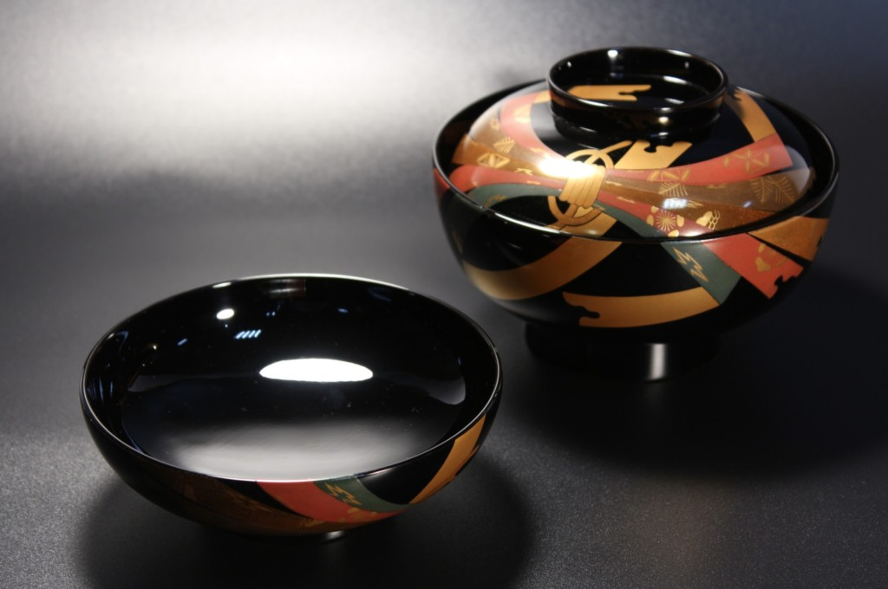
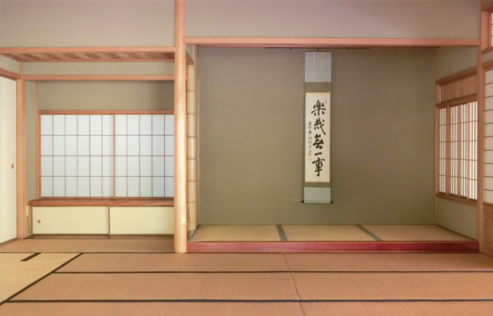

# シンプルさに宿る強さ: 日本の伝統工芸と分散システムの美学

冬の夜明け、火花散る鍛冶場で刀鍛冶が真紅に熱した鋼を打ち延ばしています。折り重ねられ鍛錬された鋼は、無駄のない美しい曲線の刀身へと姿を変え、硬さと粘り強さの絶妙なバランスによって伝説的な斬れ味と強靭さ、そして優美な外観を兼ね備えます。一方、現代のデータセンターでは、分散型ブロックチェーンネットワークが稼働しています。無数のコンピュータが連携するそのネットワーク「インターネット・コンピュータ（ICP）」上では、WebAssembly（WASM）という汎用の仮想実行環境の上でコード（スマートコントラクト）が動き、インターネットの未来を形作っています。一見かけ離れた古から変わらない鉄の工房とデジタル最先端の世界ですが、そこには共通する哲学があります。それは「シンプルであること」が生み出す強さと美しさです。日本の伝統文化が育んだ簡素の美学と、それが生み出す卓越した耐久性・機能性。そして現代の分散システム設計においても、奇しくも同じような美学が効率的で信頼性の高い技術基盤を支えているのです。日本の伝統的な職人技に見る「シンプルさ」の哲学と、DfinityのICPに代表される最新の分散技術におけるデザイン思想を探り、その美学と機能の響き合いを考察します。

## 古の工芸に宿る簡素の美と強靭さ

### 日本刀：折り重ねられた鋼の構造美

日本刀は、その洗練された形状と機能美によって世界的に知られています。刀身は幾重にも鋼を折り返し鍛える「折り返し鍛錬」によって作られ、これにより刃は非常に硬く研ぎ澄まされる一方、芯の部分には適度な柔軟性が残されます。その結果、生まれるのが**硬さ**と**粘り強さ**の両立です。この巧みな構造により、日本刀は折れにくく曲がりにくいという卓越した強度を実現し、伝統的な焼入れによって生じる刃文（はもん）は刃先の鉄を硬くするための機能上の必要から生まれたものでありながら、刀に独特の美しい表情を与えます。例えば刀身に現れる波状の刃文は、硬い刃先と靭性に富む棟との境界を示すもので、刀の美観と斬れ味を象徴する要素です。数百年以上前に鍛えられた名刀が今なお折れずに残っている例も珍しくありません。日本刀の形状自体はシンプルで機能本位ですが、その内に秘めた複雑な工芸的プロセスと構造設計によって、比類なき強靭さと長寿命を獲得しているのです。

### 漆工芸：層を重ねた簡素な優雅さ

漆（うるし）工芸は、日本の「簡素の美」を語る上で欠かせない伝統技術です。木や和紙で作られた器の表面に天然漆を何度も塗り重ね、乾かし、研ぎ磨く――気の遠くなるような反復作業によって完成する漆器は、一見すると静かな光沢を湛えた落ち着いた姿をしています。模様や装飾は控えめか無地であることも多く、その**シンプルな造形**には凛とした品格があります。しかしその美しい表面の下には幾重にも塗り重ねられた堅牢な被膜が形成されており、漆のコーティングは傷や染み、熱に対する高い耐性を器に与えます。漆は時間の経過とともに硬化が進み、強度を増す性質も持つため、適切に扱われた漆器は世代を超えて使用できる耐久性を備えています。その光沢は使い込むほどに深みを増し、美しさを保ちながら実用品として長く機能し続けるのです。華美な装飾に頼らず素材と技法の妙で勝負する漆工芸には、「少ないもので多くを成す」日本美の真髄が表れていると言えるでしょう。

### 備前焼：土と炎が生む侘びの強さ

陶磁器の世界にも、日本的な簡素の美と耐久性の融合を示す逸品があります。その代表格が岡山県の備前焼です。備前焼は釉薬（うわぐすり）を一切使わず、良質な粘土を成形した後に長時間じっくりと焼き締めることで完成します。赤褐色や焦げ茶色の素朴な焼き色が特徴で、表面には炎と灰が作り出す自然な模様が浮かび上がります。その姿は質朴で飾り気がなく、「わび・さび」の美意識に通じる静かな風合いをたたえています。素材と炎だけで生み出されるこのシンプルな焼き物は、見た目の控えめさに反して非常に頑丈です。陶土を1200度以上の高温で焼成するため緻密で硬度が高く、割れにくい強度を持つことが知られています。実際、備前焼の器は薄手であっても驚くほど丈夫で、長年の使用にも耐え得ると評判です。その堅牢さゆえに茶道の世界でも茶器として珍重されてきた歴史があります。飾らず自然体でありながら、実用に足る強さを備える備前焼には、日本文化が求める簡素の美学と実利性の融合が体現されています。

### 数寄屋建築：侘びた茶室の軽やかな構造

日本の伝統建築にも「シンプルさ」が造形美と機能性を高めた例が数多く存在します。中でも茶の湯の精神から生まれた**数寄屋造り**の建築様式は、質素簡潔ながら洗練された空間美を追求したものです。茶室を中心とする数寄屋建築では、自然の素材が生かされ、木材や竹、土壁などが調和する落ち着いた空間が作り上げられます。柱や梁は細めで、室内空間は必要最低限の広さしか持たず、意図的に簡素に設計されます。しかし、その「軽やかさ」は決して脆さを意味しません。数寄屋建築では、見た目に現れない部分で高度な構造計算と職人技が活かされ、最小限の部材でも安定した建物となるよう工夫されています。木材同士は精密に仕口（しくち）で組み合わされ、必要に応じて要所に釘や金物が使われる場合も、外からは見えないよう巧みに隠されています。伝統的木造建築の知恵である**木組み**によって力がバランスよく伝わり、細い柱でもしなやかに荷重を支え、地震などの揺れにも柔軟に対応できる茶室が実現します。例えば桂離宮に代表されるような数寄屋建築の名作は、その簡潔な意匠に反して構造的な安定性を備え、何世紀にもわたって美しい佇まいを保ってきました。侘びた静けさの中に堅牢さを秘めた数寄屋建築は、日本人の美意識と技術力が生み出した建築芸術と言えるでしょう。

### 宮大工の木組み：釘を使わない建築の強度

寺社建築を手がける**宮大工**たちの技は、日本の木造建築を語る上で欠かせません。彼らは何百年も前から、木材同士を複雑に組み合わせる木組み（仕口・継手）の技術を磨き上げ、巨大な建築を釘なしで組み上げてきました。釘に頼らない構造は木材の寿命を飛躍的に延ばし、地震などの揺れにも柔軟に対応します。実際、世界最古級の木造建築である法隆寺の五重塔（7世紀建立）が1300年以上にわたり地震国日本で倒壊せずに立ち続けているのは、この木組みによる構造の巧みさ故とも言われます。木材の接合部は雌雄一対の形状に彫り込み、**仕口**でがっちりと噛み合うため強固で、しかも金属のように硬い釘を打たない分、木が呼吸し伸縮する動きが妨げられません。どうしても釘を使う場面では、西洋の釘より軽く柔らかい鉄製の**和釘**を用い、木材を割らないよう配慮します。和釘は材質が柔らかいため木目に沿って多少しなり、木の動きに追従できるのが特徴です。こうした伝統技術により、釘を使わずとも柱や梁を長寿命かつ強固に結合し、美しい木組みの意匠も見せる建築が可能となりました。宮大工の手による社寺建築や舞台造（例：京都清水寺の舞台）は、巨大な木造建築が釘一本使われず成立している奇跡として訪れる人々を驚かせます。複雑な継手が生み出す有機的な結合部は機能美そのものであり、日本の伝統建築が **「百年の計」** どころか千年先をも見据えて強度と持続性を追求していた証と言えるでしょう。

## 現代技術に見るシンプルさ：ICPプロトコルとNim言語

### インターネット・コンピュータ（ICP）：WASMが支える次世代基盤

https://internetcomputer.org/

Dfinity財団が開発した**インターネット・コンピュータ（Internet Computer Protocol, ICP）**は、ブロックチェーン技術を基盤にインターネット上に分散型のコンピュータ資源を構築する野心的なプロジェクトです。ICPは従来のブロックチェーンとは一線を画し、ウェブのようなスピードとスケーラビリティでスマートコントラクト（ICPでは**キャニスター**と呼ばれる）を実行できるプラットフォームを目指しています。その中核にある技術要素が**WebAssembly (WASM)** の活用です。ICPでは開発者が書いたスマートコントラクトをWASM形式のバイナリにコンパイルし、各ノード上の仮想マシンで実行します。WASMは元々ウェブブラウザ向けに開発された低レベル仮想マシン仕様ですが、安全性・効率性・決定性に優れ、ブロックチェーン上で不特定のコードを各ノードで動作させる用途に理想的に適合します。この決定論的で高速な実行環境のおかげで、ICP上のスマートコントラクトは各ノード間で結果が食い違うことなく統一的に処理され、高い信頼性を確保できるのです。またWASMを用いる利点として、プログラミング言語を問わず幅広い言語でコントラクトを開発できる柔軟性が挙げられます。MotokoやRust、TypeScriptなど複数の言語をICPは公式にサポートしていますが、コンパイラさえ整備されればそれ以外の言語でもWASMターゲットを通じてキャニスター開発が可能です。  
更にICPではその動作のあらゆる部分で暗号技術を用いています。各サブネットが秘密鍵をしきい値共有（threshold secret sharing）方式で分割管理し、キャニスターの応答結果に対してノード群が共同でしきい値署名（threshold signature）を生成します。ICPではBLSベースのしきい値署名スキームを採用しており、事前にプリシグネチャ（pre-signature）を計算しておくことで、メッセージ受信時の署名負荷と通信ラウンドを最小化しています。実際の応答には、各ノードの部分署名が合成された単一のBLS署名が付与され、クライアントはサブネットの公開鍵だけでこの署名を数十ミリ秒以内に検証可能です。この仕組みにより、ユーザーはチェーン全体を同期することなく、低コストかつ数学的に決定論的（deterministic）にレスポンスの真正性を担保できます。さらに、秘密鍵が常に分割されたまま保持されるため、単一ノードの侵害による鍵漏洩リスクが大幅に低減され、安全性も飛躍的に向上します。  
ICPはこのようにシンプルな技術を採用し組み合わせることで、堅牢で柔軟な基盤を提供し、インターネットサービスそのものをブロックチェーン上に再構築し、長寿命かつ改ざん不可能なデジタルインフラを実現しようとしています。その設計思想の根底にも「シンプルさを突き詰めることで得られる強さ」が流れているように思われます。

### Nimプログラミング言語：効率・表現力・エレガンスの追求

https://nim-lang.org/

ICPの技術スタックを語る上で、スマートコントラクトを記述するプログラミング言語にも触れる必要があります。公式には前述の通りモトコ（Motoko）やRustが用いられることが多いものの、本稿ではあえて日本の美学との対比という観点から**Nim**言語に注目してみます。Nimは近年注目を集める新しいプログラミング言語で、その設計思想は「Efficient, Expressive, Elegant（効率的で、表現力豊かで、エレガント）」という言葉に集約されています。Nimは静的型付けのコンパイル言語でありながら、人間にとって読み書きしやすい簡潔な構文を持ち、Pythonのような可読性とC言語に匹敵する実行効率を両立させることを目指しています。実際、Nimコンパイラはソースコードを高度に最適化されたC言語等に変換しネイティブコードを生成するため、仮想マシンやガベージコレクションに依存せず小さく軽量な実行ファイルを生成できます。メモリ管理もデフォルトで自動参照カウント方式（ARC）を採用し決定的なタイミングでメモリ解放が行われるなど、システムプログラミングに適した予測可能な動作を示します。このため組み込みシステムやブロックチェーンコントラクトのようなリソース制約下でも、Nimで書かれたプログラムは高いパフォーマンスを発揮しやすいのです。またNimはマクロ機能や複数のプログラミングパラダイム（手続き型・オブジェクト指向・関数型）のサポートによって表現力豊かで、開発者が意図する動作を簡潔に記述できる柔軟さを備えています。言い換えれば、冗長なボイラープレートコードや複雑な文法に煩わされることなく、本質的なロジックに集中できる「簡素」なコーディング体験を提供してくれる言語なのです。Nimによって書かれたコードは必要最低限の記述で目的を達成しつつ、実行時には過不足なく効率が追求されます。この思想はまさに日本の職人技における「無駄を削ぎ落とし、本質を研ぎ澄ます」アプローチと通底しているように思われます。

## 伝統美とモダン技術の共鳴：シンプルさの哲学をめぐって

古来より日本のものづくりに息づく「シンプルさの追求」は、単なる美学上の志向に留まらず、耐久性や機能性といった実利面で大きな利点をもたらしてきました。それは現代のシステム工学においても同様です。複雑さを際限なく積み重ねるのではなく、核心にある設計理念を研ぎ澄ますことで、かえって**効率的で保守しやすく、強靭なシステム**が実現します。日本の伝統工芸では、必要以上の装飾や部品を用いず素材の持ち味と巧みな構造だけで作品の完成度を高めることが良しとされてきました。これは情報技術の世界で、設計を簡潔に保ちソフトウェアの部品点数（依存関係やコンポーネント）を可能な限り削減することがシステムの信頼性を高める、という考え方に通じます。事実、ソフトウェアアーキテクチャにおいてもシンプルで明快な構造を持つものはエラーの箇所が特定しやすく、改修も容易なため、時間の試練に耐えると言われます。

特にICPのような分散システム基盤では、一度ネットワークにデプロイされたコードが長期間にわたり不変のまま走り続けることも想定されます。その意味で、後から手の入れにくいブロックチェーン上のソフトウェアこそ、極力シンプルでバグの少ない設計・実装が求められます。WASMを実行基盤に選んだICPのアーキテクチャは、ローレベルで決定性の高いシステムを採用することで余分な魔法を排し、挙動の予測可能性とセキュリティを向上させています。これはちょうど宮大工が木と木の純粋な組み合わせだけで建物を支え、構造の挙動を職人の知恵でコントロールしたのに似ています。木組みでは釘やボルトといった外来の要素を極力使わず、素材の組み合わせだけで強度を引き出しました。同様にICPでは、WASMというオープンでミニマルな仮想機械の上で必要最小限の仕組みだけを動かし、それを暗号技術によって簡単に検証可能にすることで、システム全体の複雑性を抑えようとしているのです。WASMの低レベル制御が可能な特質とエレガントな設計思想は、まるで高度に洗練された木組み細工のように、無駄のない安定性をもたらします。

また、Nim言語に代表されるモダンな開発ツールにも、日本の伝統から学べる示唆が見られます。Nimのコードは簡潔で読みやすく、それでいてコンパイル後は効率的に動作します。まさに「見た目はシンプル、中身は強靭」という日本刀や漆器にも通じる哲学です。例えば、武骨で重厚な刀身を支える刃文のように、Nimの軽量なランタイムと最適化コンパイルは表に見えない部分でプログラムの堅牢性を支えています。開発者にとって余計な負担をかけないエレガントな文法は、道具そのものの存在を意識させずに職人の技を引き立てる日本の伝統工具のようでもあります。結果として、生み出されるソフトウェア（製品）は無駄なく洗練され、メンテナンスもしやすく長期に信頼して使えるものとなるでしょう。

極限まで洗練されたシンプルさは、美と機能の両立を可能にします。日本の寺社建築が何百年もの風雪に耐え人々を魅了し続けるように、優れたソフトウェアシステムもまた時を超えて価値を提供し続けるポテンシャルを持っています。ICPが目指す **「長く生きるインターネット上のシステム」** というビジョンは、奇しくも法隆寺や伊勢神宮に見るような **「永続する構造体」** への志向と響き合います。伊勢神宮では20年ごとに社殿を全く同じ設計で建て替える式年遷宮が1300年途絶えず続いていますが、それも設計思想を変えずシンプルさゆえに維持可能な仕組みと言えるでしょう。システム開発においても、シンプルな設計は将来にわたる継続的な改善や再実装を容易にし、結果として寿命を延ばすことにつながります。伝統と革新、一見相反するように見える二つの世界が、「長く役立つものを作りたい」という共通の願いによってシンプルさの哲学で結ばれているのは、興味深い巡り合わせです。

---

日本の伝統工芸に見るミニマリズムの美学と、それが生み出す卓越した耐久性・機能性。そして現代の分散システムとプログラミング言語におけるシンプルデザインの追求。これら二つは時代も分野も異なりますが、その核心にある理念は驚くほど似通っています。複雑さを排し本質に集中することで得られる強さ――それは侍の刀にも、漆塗りの器にも、木組みの堂塔にも宿り、そしてデジタルなブロックチェーンの世界にも脈々と受け継がれています。シンプルであることは決して凡庸であることを意味しません。むしろ研ぎ澄まされたシンプルさは高度な知恵と技巧の結晶であり、時間の試練に耐える普遍性を持ち合わせます。日本の職人たちが残した「簡素の中にこそ真実の美と強さがある」という教えは、21世紀のテクノロジー開発においても貴重な指針となり得るでしょう。自然と調和しながら永続する建築物や工芸品のように、我々が作るデジタル社会の基盤もまた、シンプルであるがゆえに堅牢で持続可能なものとなる――本稿で辿った伝統と革新の物語は、そうした未来へのヒントを私たちに与えてくれます。
